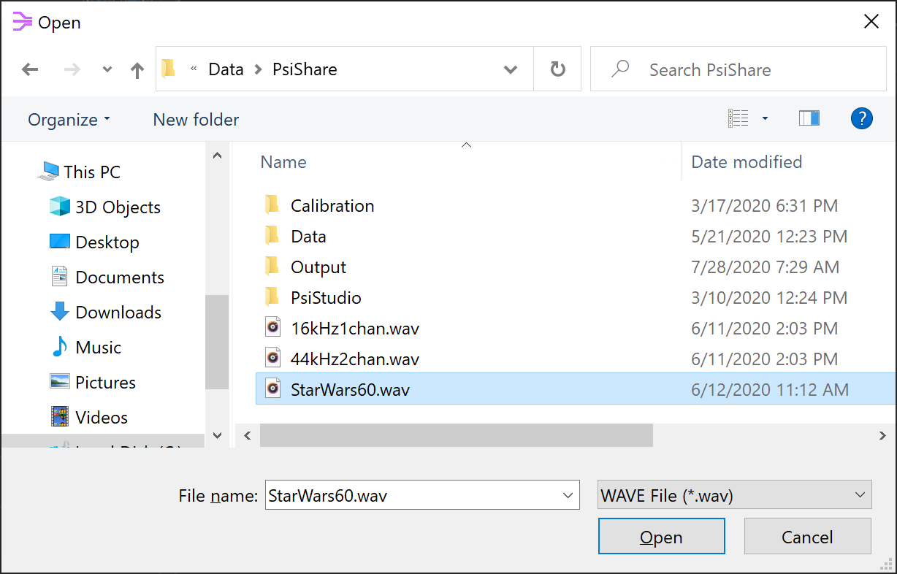
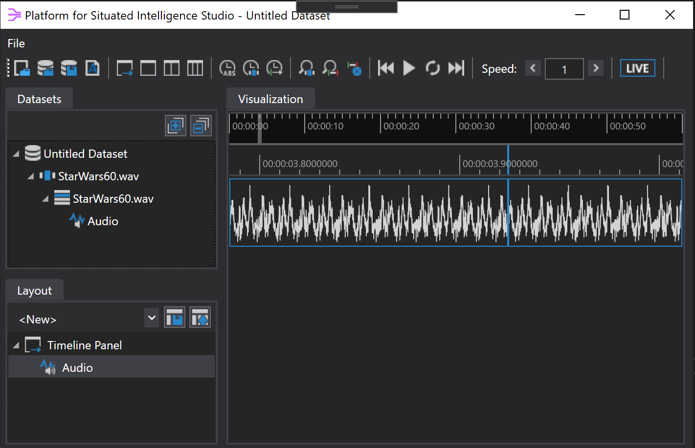

# 3rd Party Stream Readers

Platform for Situated Intelligence Studio (PsiStudio in short) and programmatic APIs for accessing data stores may be extended with 3rd party stream readers to support custom storage formats. Here we describe how to implement such a 3rd party stream reader and add it to PsiStudio.

The process requires the following steps:

1) Implement the [`IStreamReader` interface](https://github.com/microsoft/psi/blob/master/Sources/Runtime/Microsoft.Psi/Data/IStreamReader.cs) to provide the data streams.
2) Add the class-level [`StreamReader` attribute](https://github.com/microsoft/psi/blob/master/Sources/Runtime/Microsoft.Psi/Data/Importer.cs) to describe the file type.
3) Add the assembly to PsiStudio's settings for discovery.
4) Create a specific `Importer` class for consistency with \psi patterns of usage.
5) Create `Dataset` and `Session` extension methods for consistency.

In the following sections we will walk through the process, using the [`WaveFileStreamReader`](https://github.com/microsoft/psi/blob/master/Sources/Audio/Microsoft.Psi.Audio/WaveFileStreamReader.cs) as an example.

## Implementing a Custom Stream Reader

The majority of the effort is in implementing the [`IStreamReader` interface](https://github.com/microsoft/psi/blob/master/Sources/Runtime/Microsoft.Psi/Data/IStreamReader.cs); part of the runtime in the `Microsoft.Psi.Data` namespace. This interface allows for querying for available streams, opening streams, and moving through or randomly accessing them, as well as ancillary features such as supplemental metadata.

The \psi store format is highly optimized and is the recommended storage format for \psi, but there is nothing special or more first-class about it. The [`PsiStoreStreamReader`](https://github.com/microsoft/psi/blob/master/Sources/Runtime/Microsoft.Psi/Data/PsiStoreStreamReader.cs) used to read \psi stores is, in fact, an `IStreamReader`; a peer to 3rd party readers we can construct for any other format. An example stream reader for a more ubiquitous data format is the [`WaveFileStreamReader`](https://github.com/microsoft/psi/blob/master/Sources/Audio/Microsoft.Psi.Audio/WaveFileStreamReader.cs). This is a good example to follow when building your own.

```csharp
[StreamReader("WAVE File", ".wav")]
public sealed class WaveFileStreamReader : IStreamReader
{
    public WaveFileStreamReader(string name, string path)
    {
        this.Name = name;
        this.Path = path;
        ...
    }

    public string Name { get; private set; }

    public string Path { get; private set; }

    ...
}
```

Our `WaveFileStreamReader` class is an `IStreamReader` and, in turn, `IDisposable`.

Readers marked by the class-level `StreamReader` attribute are discovered by PsiStudio (see next section). This attribute declares the name (e.g. `"WAVE File"`) and file extension (e.g. `".wav"`) that the stream reader asserts it is able to read. These are used to populate options in the File Dialog in PsiStudio and potentially other tooling in the future.

*IMPORTANT:* A constructor with the above signature (`string name, string path`) is required by PsiStudio. It is used to create a reader when the user selects an applicable storage file. The `Name` and `Path` properties are required by the `IStreamReader` interface.

In addition to the constructor, a new stream reader instance can be created by `OpenNew()`. The idea is that a caller may want multiple readers against the same data but with some shared state (e.g. cache, index, ...) between them.

```csharp
public IStreamReader OpenNew()
{
    return new WaveFileStreamReader(this.Name, this.Path, this.startTime);
}
```

### Querying for Data Streams

Consumers expect readers to enumerate the `AvailableStreams` and to answer queries for the existence of and/or the `IStreamMetadata` for an individual stream.

```csharp
public IEnumerable<IStreamMetadata> AvailableStreams
{
    get
    {
        yield return this.audioStreamMetadata;
    }
}

public bool ContainsStream(string name)
{
    ...
}

public IStreamMetadata GetStreamMetadata(string name)
{
    ...
}
```

### Stream Metadata

Stream metadata can be our own implementation of [`IStreamMetadata`](https://github.com/microsoft/psi/blob/master/Sources/Runtime/Microsoft.Psi/Common/IStreamMetadata.cs) directly or else can use the [`StreamMetadataBase`](https://github.com/microsoft/psi/blob/master/Sources/Runtime/Microsoft.Psi/Common/StreamMetadataBase.cs) class as we do here:

```csharp
public class WaveAudioStreamMetadata : StreamMetadataBase
{
    public WaveAudioStreamMetadata(
        string name,
        string typeName,
        string partitionName,
        string partitionPath,
        DateTime first,
        DateTime last,
        int averageMessageSize,
        int messageCount,
        int averageLatency)
        : base(
            name,
            AudioSourceId,
            typeName,
            partitionName,
            partitionPath,
            first,
            last,
            averageMessageSize,
            messageCount,
            averageLatency)
    {
    }
}
```

The stream `name` is up to us. The `typeName` is the assembly-qualified name of the .NET type representing message data on the stream. The `partitionName` and `partitionPath` are our choice, but generally are the file name and path.

The `first` and `last` arguments are the time of the first and last message on the stream. This should be pre-computed for the data store as it is used by tools such as PsiStudio to reason about the extent of the data before reading it. An exception to this is "live mode" (see `IsLive()` below).

The `IStreamMetadata` interface makes a finer distinction between "start time" and `OpenedTime`, `FirstMessageCreationTime` or `FirstMessageOriginatingTime` and also between "end time" and
 `ClosedTime`,  `LastMessageCreationTime` or `LastMessageOriginatingTime`. These are important distinctions to make when possible, but in this example we allow the base class to coalesce them as WAVE files contain no such information.

We need to do our best to compute statistics such as the `averageMessageSize` (in bytes), the total `messageCount` and the `averageLatency` of messages on the stream. This is used by tools to visualize and debug \psi data streams.

```csharp
this.audioStreamMetadata = new WaveAudioStreamMetadata(
    "Audio",
    typeof(AudioBuffer).AssemblyQualifiedName,
    name,
    path,
    startTime,
    endTime,
    dataLength / messageCount,
    messageCount,
    audioBufferSizeMs);
```

### Message Time Extents

Similar to the time extents for each individual stream, an `IStreamReader` must provide the full extents across _all_ of the streams contained in the store.

```csharp
public TimeInterval MessageCreationTimeInterval
{
    get
    {
        ...
    }
} 

public TimeInterval MessageOriginatingTimeInterval
{
    get
    {
        ...
    }
}
```

It is possible to allow reading from a store _while_ it is being actively written to. In this case, the time intervals returned above are the _current_ extent of the data but may subsequently change. In order to alert consumers of our reader to this situation, we would return `true` from `IsLive()`. Here we assume that WAVE files being read are not being written to (opened with read-only file sharing), and return `false`.

```csharp
public bool IsLive()
{
    return false;
}
```

### Opening Data Streams

Getting to the primary purpose of a reader, we must provide a means of opening streams. The `OpenStream(...)` method returns stream metadata and accepts a `target` callback that will be held and later called with message data (`T`) and each message `Envelope` while traversing the data. Our reader supports a single `"Audio"` stream of `AudioBuffer` messages.

```csharp
private List<Delegate> audioTargets = new List<Delegate>();

public IStreamMetadata OpenStream<T>(string name, Action<T, Envelope> target, Func<T> allocator = null)
{
    if (name != "Audio")
    {
        throw new ArgumentException($"Only 'Audio' stream is supported.");
    }

    if (typeof(T) != typeof(AudioBuffer))
    {
        throw new ArgumentException("The Audio stream is of type AudioBuffer.");
    }

    this.audioTargets.Add(target);
    return this.audioStreamMetadata;
}
```

The `OpenStreamIndex()` method is similar, but the `target` callback deserves some explanation. It is passed each `Envelope` as with `OpenStream()` but rather than being called with message data (`T`) directly, it is given a `Func<IStreamReader, T>`. That is, a function that when called with a stream reader, will return the message data. The intent is that this represents an "index" into the data. These functions may be held by the consumer and used to randomly access message data. This is explained in more detail in the following section covering traversing the message data.

```csharp
private List<Delegate> audioIndexTargets = new List<Delegate>();

public IStreamMetadata OpenStreamIndex<T>(string name, Action<Func<IStreamReader, T>, Envelope> target)
{
    ...

    this.audioIndexTargets.Add(target);
    return this.audioStreamMetadata;
}
```

A consumer may `Seek(...)` to a particular time interval within the data store; allowing traversal of a subset. The given `TimeInterval` specifies the range of messages to traverse; seeking to the first within the interval and causing message traversal to stop at the last within the interval.

```csharp
private TimeInterval seekInterval = TimeInterval.Infinite;

public void Seek(TimeInterval interval, bool useOriginatingTime = false)
{
    this.seekInterval = interval;
    ...
}
```

### Traversing Message Data

Finally, we provide a means of traversing the data. Consumers can call `MoveNext(...)` to walk the streams until it returns `false` indicating the end of currently available data. Note that, while we have only the single audio stream in our case,  in general `MoveNext(...)` traverses _all_ of the streams provided by a reader.

As the data is traversed, the target callbacks previously given in calls to `OpenStream(...)` and `OpenStreamIndex(...)` are called. We will describe how these targets are invoked shortly.

```csharp
public bool MoveNext(out Envelope envelope)
{
    if (
        !this.Next(out var audio, out envelope) ||
        !this.seekInterval.PointIsWithin(envelope.OriginatingTime))
    {
        return false;
    }

    // invoke target callbacks here

    return true;
}
```

Consumers may instead rely on our reader to traverse the data rather than one `MoveNext()` at a time. A subset may be specified by the given `ReplayDescriptor` and the operation may be canceled. Again, target callbacks are called as we go.

```csharp
public void ReadAll(ReplayDescriptor descriptor, CancellationToken cancelationToken = default)
{
    this.Seek(descriptor.Interval);
    while (!cancelationToken.IsCancellationRequested && this.Next(out var audio, out var envelope))
    {
        if (descriptor.Interval.PointIsWithin(envelope.OriginatingTime))
        {
            // invoke target callbacks here
        }
    }
}
```

To invoke the target callback during `MoveNext(...)` or `ReadAll(...)` we enumerate and `DynamicInvoke(...)` them. Note that there may be multiple callbacks even if the reader supports only a single stream; having seen multiple calls to `OpenStream(...)` from different consumers.

```csharp
foreach (Delegate action in this.audioTargets)
{
    action.DynamicInvoke(audio, envelope);
}
```

Invoking the stream index callbacks is a bit more involved. Rather than calling with message data directly, we call with an "index" function that, when later called, will retrieve the message data. The idea is that a consumer may hold onto these "index" functions to be later called; providing random access to the message data. It is also possible to call these "index" functions against a _different_ instance of the reader applied to the same underlying data; likely having been created by `OpenNew()`.

This means that the `Func<IStreamReader, T>` given to the callback needs to contain all of the state necessary to later retrieve the message data. It needs to be a closure capturing this state. In the case of the WAVE file reader, this includes the byte `position` and the `sequenceId`. Other readers may have their own requirements. For example the `PsiStoreStreamReader` needs to known the extent ID. These details are not exposed by the more general `IStreamReader` interface and instead remain opaquely captured by the "index" functions given to stream index callbacks.

```csharp
foreach (Delegate action in this.audioIndexTargets)
{
    var position = this.waveFileReader.BaseStream.Position;
    var sequenceId = this.sequenceId;
    var index = new Func<IStreamReader, AudioBuffer>(
        reader => ((WaveFileStreamReader)reader).Read(position, sequenceId))

    action.DynamicInvoke(index, envelope);
}
```

### Supplemental Metadata

The stream metadata returned when by `GetStreamMetadata(...)` and when enumerating `AvailableStreams` is of a fixed schema defined by `IStreamMetadata`. An additional facility exists for stream readers to supplement this arbitrarily with extra per-stream information not otherwise contained in the message data. Here we provide `WaveFormat` information retrieved from the file header including the number of channels on the audio stream and whether the format is PCM, IEEE float, etc.

```csharp
public T GetSupplementalMetadata<T>(string streamName)
{
    if (name != AudioStreamName)
    {
        throw new ArgumentException($"Only '{AudioStreamName}' stream is supported.");
    }

    if (typeof(T) != typeof(WaveFormat))
    {
        throw new ArgumentException("The Audio stream supports only supplemental metadata of type WaveFormat.");
    }

    return (T)(object)this.waveFormat;
}
```

## Loading Custom Readers in PsiStudio

To allow PsiStudio to discover custom readers and to surface them in the user interface (e.g. the file open dialog), the class is marked with the [`StreamReader` attribute](https://github.com/microsoft/psi/blob/master/Sources/Runtime/Microsoft.Psi/Data/Importer.cs) and the assembly containing such a marked class is added to PsiStudio's settings file.



To enable PsiStudio to load external DLLs, you can add an `<AdditionalAssemblies>` XML tag inside the main `<PsiStudioSettings>` tag in the PsiStudioSettings.xml file. This settings file is stored in the PsiStudio folder under our user Documents folder. You can specify the assemblies containing custom stream readers that you would like PsiStudio to load with an `<AdditionalAssemblies>` tag, for example:

```xml
    <AdditionalAssemblies>C:\MyStreamReaders\MyStreamReaders.dll</AdditionalAssemblies>
```

Multiple assemblies can be specified via a semicolon-separated list, like below: 

```xml
    <AdditionalAssemblies>C:\MyStreamReaders\MyStreamReaders.dll;C:\MyOtherStreamReaders\MyOtherStreamReaders.dll</AdditionalAssemblies>
```

The stream reader may then be used within PsiStudio to visualize data. 



## Adding an Importer

At this point our stream reader can also be used within a \psi pipeline by creating an [`Importer` class](https://github.com/microsoft/psi/blob/master/Sources/Runtime/Microsoft.Psi/Data/Importer.cs) directly, given the constructor taking an `IStreamReader`:

```csharp
var reader = new WaveFileStreamReader(name, path, startTime, audioBufferSizeMs);
var importer = new Importer(pipeline, reader);
```

However, as you may have noticed, the common pattern in \psi is to have a type-specific importer. Implementors of new `IStreamReaders` are encouraged to follow this pattern.

```csharp
public sealed class WaveFileImporter : Importer
{
    public WaveFileImporter(
        Pipeline pipeline,
        string name,
        string path,
        DateTime startTime,
        int audioBufferSizeMs)
        : base(
            pipeline,
            new WaveFileStreamReader(
                name,
                path,
                startTime,
                audioBufferSizeMs))
    {
    }
}
```

And just as we use `PsiStore.Open(...)` to read \psi stores, we follow the same pattern with a static `WaveFileStore` class:

```csharp
    public static class WaveFileStore
    {
        public static WaveFileImporter Open(
            Pipeline pipeline,
            string name,
            string path,
            DateTime startTime,
            int audioBufferSizeMs)
        {
            return new WaveFileImporter(
                pipeline,
                name,
                path,
                startTime,
                audioBufferSizeMs);
        }
    }
```

Usage now looks similar to \psi stores.

```csharp
var store = WaveFileStore.Open(pipeline, "demo.wav", "C:\\Data", DateTime.UtcNow, 20);
var audio = store.OpenStream<AudioBuffer>("Audio");
```

## Adding `Dataset` and `Session` Extension Methods

Continuing to follow the common patterns in \psi, we also provide extension methods for `Dataset.AddSessionFromWaveFileStore(...)` and `Session.AddWaveFileStorePartition(...)`.

```csharp
public static class DatasetExtensions
{
    public static Session AddSessionFromWaveFileStore(
        this Dataset dataset,
        string storeName,
        string storePath,
        DateTime startTime,
        int audioBufferSizeMs,
        string sessionName = null,
        string partitionName = null)
    {
        return dataset.AddSessionFromStore(
            new WaveFileStreamReader(
                storeName,
                storePath,
                startTime,
                audioBufferSizeMs),
            sessionName,
            partitionName);
    }

    public static Partition<WaveFileStreamReader> AddWaveFileStorePartition(
        this Session session,
        string storeName,
        string storePath,
        DateTime startTime,
        int audioBufferSizeMs,
        string partitionName = null)
    {
        return session.AddStorePartition(
            new WaveFileStreamReader(
                storeName,
                storePath,
                startTime,
                audioBufferSizeMs),
            partitionName);
    }
}
```

This boiler plate code improves the end-user experience and encourages type safety.
