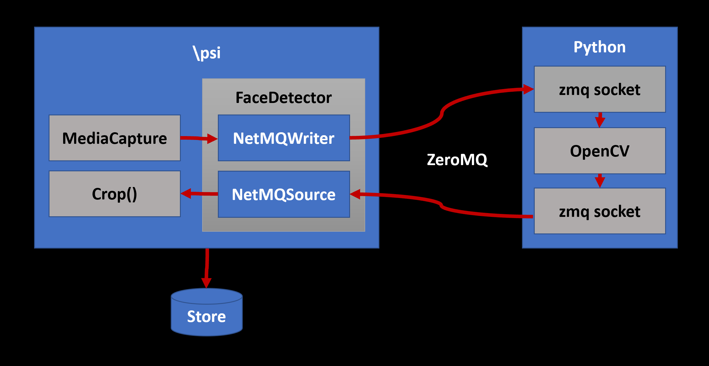
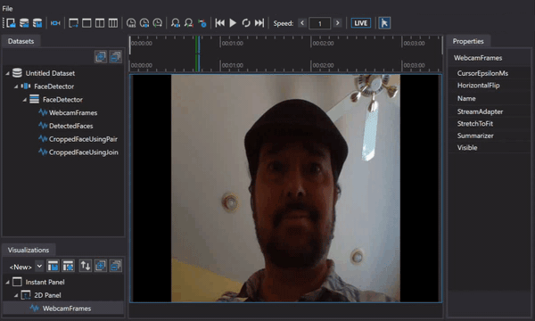
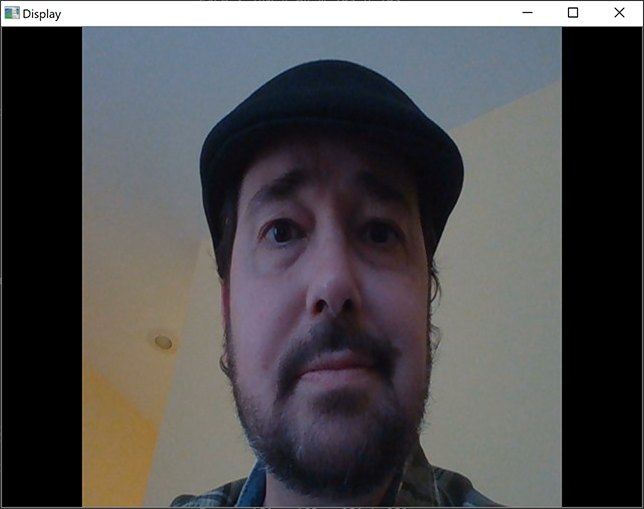
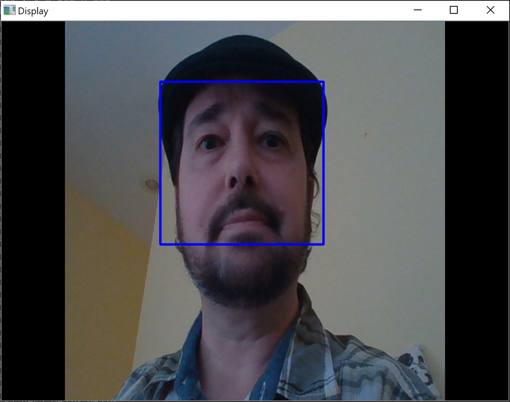
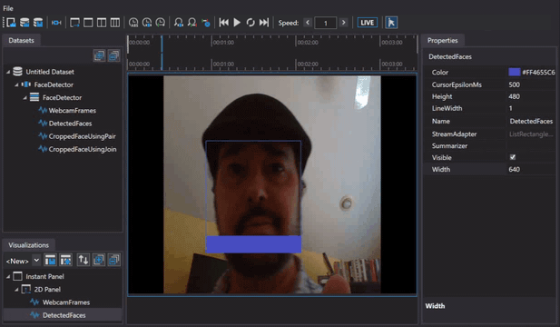
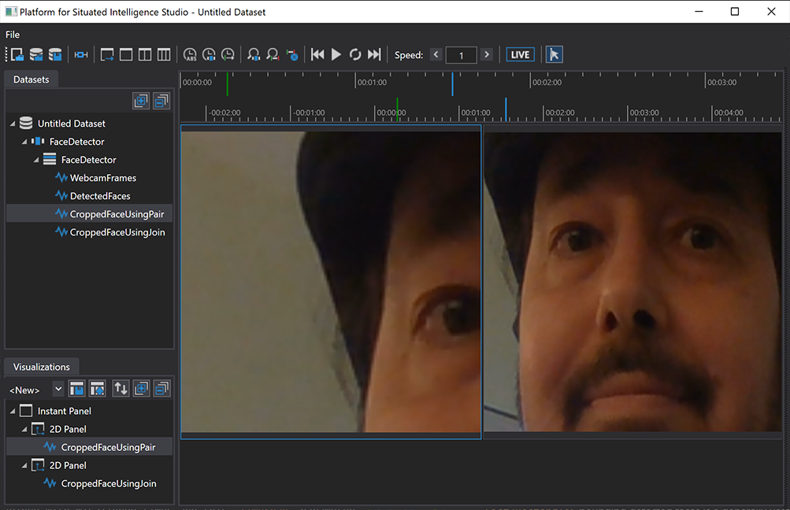

This walk-through is an example of a situation in which we have some useful functionality that we want to leverage from another ecosystem. In this case, we will look at how to interoperate with Python, in turn leveraging OpenCV to do face detection. One way to approach OpenCV in \psi is [with Managed C++ as demonstrated here](https://github.com/microsoft/psi-samples/tree/main/Samples/OpenCVSample). However, for this walkthrough we will call OpenCV from Python, and illustrate how to do cross-process communication between a \psi application (which will capture the images) and a Python script (which will run the face detection via OpenCV). The structure of the system is illustrated below.

Then you can fill in more details. The psi application is cross-platform (can run on either windows or linux), and we persists data. Data can be visualized in PsiStudio, etc. 



Along the way, we will learn to use PsiStudio and PsiStoreTool and the message queueing components in `Microsoft.Psi.Interop` as well as how to use the `Join()` and `Pair()` operators to synchronize and fuse streams.

The walk-through ends with detecting and cropping human faces from the captured video stream, but you could then take the application in many directions. For instance, directing a robot to make eye contact.

We will start by creating something of a "hello world" \psi application that captures and persists video (Linux/Windows) and will visualize this in PsiStudio (Windows). Then we will send the video to Python where we will detect faces using OpenCV and send the results back to \psi.

## Media Capture

Let's start by creating a .NET console application and including the \psi runtime and NuGet packages needed to work with media capture and imaging. We will use the `dotnet` command-line tool and your favorite text editor (perhaps [VS Code](https://code.visualstudio.com/)). You may instead create the project in Visual Studio if you have it, but here we will use the command-line tools:

The following command will create the initial project and Program.cs:

```bash
$ dotnet new console -n FaceDetectionSample
$ cd FaceDetectionSample
```

Next, let's open Program.cs in our favorite editor and add the following `using` statements (we'll add platform-specific imaging and media NuGets shortly):

```csharp
using Microsoft.Psi;
using Microsoft.Psi.Imaging;
using Microsoft.Psi.Media;
```

To create a \psi pipeline that we can exit with a key press, add the following to `Main()`:

```csharp
using (var pipeline = Pipeline.Create())
{
    // setup media capture (video + audio)
    // TODO

    // run the pipeline
    pipeline.RunAsync();

    Console.WriteLine("Press Enter key to quit...");
    Console.ReadLine();
}
```

The `MediaCapture` \psi component will be used to capture a stream of frames from a webcam. There are Linux and Windows versions of this component. The following sets of steps are platform-specific.

### Steps for Linux

Add the Linux-specific NuGet packages:

```bash
$ dotnet add package Microsoft.Psi.Media.Linux
$ dotnet add package Microsoft.Psi.Imaging.Linux
```

Replace the `TODO` with the following:

```csharp
var mediaCapture = new MediaCapture(pipeline, 1280, 720, "/dev/video0")
```

### Steps for Windows

For Windows we need to change the target framework and platform target to be compatible with the Windows version of the media and imaging components. For reference, [here you will find a list of \psi components and their platform requirements](https://github.com/microsoft/psi/wiki/List-of-Components).

Update the `TargetFramework` element in `FaceDetectionSample.csproj` to `net472` and add a new `<PlatformTarget>` element set to `x64`:

```xml
<TargetFramework>net472</TargetFramework>
<PlatformTarget>x64</PlatformTarget>
```

Add the Windows-specific NuGet packages:

```bash
$ dotnet add package Microsoft.Psi.Media.Windows.x64
$ dotnet add package Microsoft.Psi.Imaging.Windows
```

Replace the `TODO` with the following:

```csharp
var mediaCapture = new MediaCapture(pipeline, 1280, 720);
```

----

From this point forward the remaining code and interop components we use will work on any platform. The \psi runtime itself is platform agnostic (including macOS, however a `MediaCapture` component is currently not available).

Let's start by getting the stream of frames from the webcam. We'll resize them to `640` by `480` regardless of the camera settings to reduce the amount of data we're dealing with. `Resize(...)` is one of the many stream operators \psi provides for manipulating images. Others include, encoding/decoding, cropping, resizing, rotating among others described in the [Imaging Overview](./Imaging-Overview.md).

```csharp
var webcamFrames = mediaCapture.Out.Resize(640, 480);
webcamFrames.Do(_ => Console.Write('.'));
```

Running this app will show it is working by outputting a `'.'` for each frame.

```bash
dotnet run
```

In order to see what's being captured, we will `Write` the stream to a \psi store to be viewed in PsiStudio (on Windows):

```csharp
// create a store and persist streams
var store = PsiStore.Create(pipeline, "FaceDetector", @"~/Data");
webcamFrames.Write("WebcamFrames", store);
```

Persisting raw sensor data to a \psi store is an excellent way to create a reproducible dataset from which you can play back and debug an application.

## Visualizing in PsiStudio

Running the app will create a \psi store that we may then open in PsiStudio (on Windows). This works either _while_ the app is running ("Live" mode) or to review recorded data after the app has exited. Right-clicking the `"WebcamFrames"` and choosing "Visualize Image in New Panel" will show us the messages.



## Visualizing in Python

PsiStudio is at this time a Windows-only application. For this project we will need to send the data to Python anyway, so let's quickly see how to do that and go ahead and use facilities in Python to visualize for those on Linux.

We will send the data cross-process over a [ZeroMQ message queue](https://zeromq.org/). To conserve bytes over the "wire" we will down-sample the frames. Timing and operations like sampling, interpolation and synchronization are well supported in \psi. There are other [variants described in the documentation](https://github.com/microsoft/psi/wiki/Interpolation-and-Sampling).

We will also encode as lossy JPEG. Imaging operations such as `EncodeJpeg()` are available on streams of `Shared<Image>`, which is the commonly used image type in \psi and is what comes out of the `MediaCapture` component. `Shared<T>` in general is a [\psi mechanism to mitigate the costs of frequent large memory allocations and garbage collection](https://github.com/microsoft/psi/wiki/Shared-Objects).

Encoding converts `Shared<Image>` to `Shared<EncodedImage>`. Because `Shared<EncodedImage>` is a very \psi centric data type, we will convert this to raw bytes (`byte[]`) for Python.

```csharp
// create down-sized, down-sampled, sparse, compressed, stream of frames
var webcamBytes =
    webcamFrames
        .Sample(TimeSpan.FromMilliseconds(200))
        .EncodeJpeg(90, DeliveryPolicy.LatestMessage)
        .Select(jpg => jpg.Resource.GetBuffer());
webcamBytes.Write("WebcamBytes", store);
```

Notice that the `.EncodeJpeg(...)` operator has a second parameter which specifies a delivery policy. Delivery policies generally control whether and when the messages flowing over streams get dropped or throttled as described in the [Delivery Policies](./Delivery-Policies.md) topic. In this case, we are specifying `LatestMessage` which ensures that, in the event that the encoder cannot keep up, messages are dropped.

## PsiStoreTool

Alongside PsiStudio in the source [is the cross-platform command-line `PsiStoreTool`](https://github.com/microsoft/psi/tree/master/Sources/Tools/PsiStoreTool). This allows us to explore a store, albeit without the visual power of PsiStudio.

For example, we can see that our store contains the "WebcamFrames" stream of `Shared<EncodedImage>` and a "WebcamBytes" stream of `byte[]` as we expect:

```bash
$ PsiStoreTool.exe list -p ~/Data -d FaceDetector

Platform for Situated Intelligence Store Tool
2 Available Streams (store=FaceDetector, path=~/Data/)
WebcamFrames (Microsoft.Psi.Shared`1[[Microsoft.Psi.Imaging.EncodedImage)
WebcamBytes (System.Byte[])
```

We can even look at the messages:

```bash
$ PsiStoreTool.exe messages -p ~/Data -d FaceDetector -s WebcamBytes

Platform for Situated Intelligence Store Tool
Stream Messages (stream=WebcamBytes, store=FaceDetector, path=~/Data, number=2147483647)
Originating Time: 7/17/2020 12:51:31 AM
Message:
    255
    216
    255
    ...
Originating Time: 7/17/2020 12:51:32 AM
Message:
    255
    216
    255
    ...
Originating Time: 7/17/2020 12:51:33 AM
Message:
    255
    216
    255
    ...
```

Perhaps not as visual as in PsiStudio but useful sometimes for quick debugging.

## Transporting Over Message Queue

An interesting thing we _can_ do with PsiStoreTool is to send messages from a store to a [ZeroMQ message queue](https://zeromq.org/). This allows us to consume (and visualize) in other environments. We may use one of several widely supported encodings such as [JSON](http://json.org/) or [MessagePack](https://msgpack.org/). ZeroMQ is supported in many languages. JSON is obviously ubiquitous but MessagePack is much more compact and is supported in 50+ languages.

```bash
$ PsiStoreTool.exe send -p ~/Data -d FaceDetector -s WebcamBytes -t frames -a tcp://127.0.0.1:30000 -m msg

Platform for Situated Intelligence Store Tool
Saving Stream Messages (stream=WebcamBytes, store=FaceDetector, path=C:\Data\Face\, topic=frames, address=tcp://127.0.0.1:30000, format=msg)
```

This sends the `WebcamBytes` stream, encoded with MessagePack (`-m msg`), as a particular topic (`-t frames`) over a ZeroMQ local port 30000 TCP channel (`-a tcp://127.0.0.1:30000`). Next we will consume this in Python.

## Consuming \psi Data in Python

To consume this in Python, we will need the ZeroMQ (`zmq`) and MessagePack (`msgpack`) libraries. We will also need the OpenCV (`opencv-python`) and Pillow libraries for working with images.

```python
python -m pip install zmq msgpack opencv-python Pillow
```

In a new `FaceDetector.py` file, we start by importing these:

```python
import zmq, msgpack
import sys, cv2, io, numpy
from PIL import Image
```

To read the data we will subscribe to the `"frames"` topic on the same local TCP socket on which PsiStoreTool publishes.

```python
input = zmq.Context().socket(zmq.SUB)
input.setsockopt_string(zmq.SUBSCRIBE, u"frames")
input.connect("tcp://127.0.0.1:30000")
```

Let's make a function to read frames as images:

```python
def readFrame():
    [topic, payload] = input.recv_multipart()
    message = msgpack.unpackb(payload, raw=True)
    frame = message[b"message"]
    originatingTime = message[b"originatingTime"]
    image = cv2.cvtColor(numpy.array(Image.open(io.BytesIO(bytearray(frame)))), cv2.COLOR_BGR2RGB)
    return (image, originatingTime)
```

You can see that messages are multipart containing the topic name and our payload, which in turn has a `"message"` and an `"originatingTime"` field.

Originating time tracks the time that sensor data entered the system; essentially when it was observed in the real world. This time is propagated through the graph and is [used for synchronization](https://github.com/microsoft/psi/wiki/Brief-Introduction#Synchronization). Tracking this `originatingTime` from \psi into Python will be very important later once we are producing messages (face detection results) back to \psi.

Now to read and display the images:

```python
cv2.namedWindow("Display")
while True:
    frame, originatingTime = readFrame()
    cv2.imshow("Display", numpy.array(frame))
    if cv2.waitKey(1) % 256 == 27: # press ESC to exit
        break
cv2.destroyAllWindows()
```



## Direct Communication

PsiStoreTool is merely a \psi application and the mechanics used to communicate across processes are available to us as [components in `Microsoft.Psi.Interop`](https://github.com/microsoft/psi/tree/master/Sources/Runtime/Microsoft.Psi.Interop). In fact, the interop system is quite extensible with places to plug in your own formats and transports. We'll be using the out-of-the-box ZeroMQ transport and MessagePack format.

The \psi runtime and many of the components are cross platform (Linux, Mac, Windows) and may be used across .NET languages (F#, C#, ...). When the target runtime is Python (e.g. for data science or ML) or JavaScript (for web "dashboards" or teleop) or something else, then one approach is to transport \psi-style streams of data across processes. In case you are interested in setting up communication between two different \psi applications (_\psi_ processes on both ends as opposed to \psi and Python) then [remoting is recommended as a more efficient and type safe system,](https://github.com/microsoft/psi/wiki/Remoting) but for bridging between a \psi application and the "outside world" the [tools of choice are found in `Microsoft.Psi.Interop`](https://github.com/microsoft/psi/wiki/Interop).

We have shown that PsiStoreTool can send data, but we ultimately want to send data from the \psi app. Let’s modify it to accomplish this. Back in our .NET app, add the NuGet package:

```bash
dotnet add package Microsoft.Psi.Interop
```

And the following `using` statements:

```csharp
using Microsoft.Psi.Interop.Format;
using Microsoft.Psi.Interop.Transport;
```

With the `NetMQWriter` component, we can easily replicate the PsiStoreTool behavior within the app:

```csharp
// send frames over ZeroMQ
var frameWriter = new NetMQWriter<byte[]>(
    pipeline,
    "frames",
    "tcp://127.0.0.1:30000",
    MessagePackFormat.Instance);
webcamBytes.PipeTo(frameWriter);
```

## Detect Faces

Here we will create a face detection solution that runs locally using Python and OpenCV. We'll use the `frontalface` Cascade classifier available in the OpenCV repository. You can [download the trained classifier from here in the OpenCV GitHub repository](https://github.com/opencv/opencv/blob/master/data/haarcascades/haarcascade_frontalface_default.xml) and place the XML file alongside the `FaceDetector.py` file.

Now we'll use this classifier against video frames:

```python
faceCascade = cv2.CascadeClassifier("haarcascade_frontalface_default.xml")

def detectFaces(frame):
    gray = cv2.cvtColor(numpy.array(frame), cv2.COLOR_BGR2GRAY)
    faces = faceCascade.detectMultiScale(gray, scaleFactor=1.1, minNeighbors=5, minSize=(30, 30))
    return faces
```

We will publish results to another ZeroMQ socket which we will use to send the results back to the \psi application; again, MessagePack encoded:

```python
output = zmq.Context().socket(zmq.PUB)
output.bind("tcp://127.0.0.1:30001")
```

Just as messages coming _from_ \psi have a `message` and an `originatingTime`, so must messages sent back. Being able to correlate the originating times from \psi to Python and back to \psi will prove very useful for synchronizing the results. We'll be able to clearly see this once we look at the cropped faces in PsiStudio.

```python
def writeFaces(faces, originatingTime):
    rects = []
    for (x, y, w, h) in faces:
        print("Face x={0} y={1} w={2} h={3}".format(x, y, w, h))
        face = {}
        face[u"x"] = int(x)
        face[u"y"] = int(y)
        face[u"w"] = int(w)
        face[u"h"] = int(h)
        rects.append(face)
    if len(rects) > 0:
        payload = {}
        payload[u"message"] = rects
        payload[u"originatingTime"] = originatingTime
        output.send_multipart(["faces".encode(), msgpack.dumps(payload)])
```

Now in our loop, just add two more lines to detect and write faces in each read frame:

```python
frame, originatingTime = readFrame()
faces = detectFaces(frame)
writeFaces(faces, originatingTime)
```

Running this, we can see that it's working; printing detected face rectangles to the console. If we want to be a bit fancier, we can draw bounding boxes on the frame before displaying it:

```python
for (x,y,w,h) in faces:
    cv2.rectangle(frame, (x,y), (x + w, y + h), (255, 0, 0), 2)
```



## Receiving Information from Python in \psi

More importantly, we can now receive this information back in \psi. Using the `NetMQSource` component, we can subscribe to the `faces` topic being published by our Python code:

```csharp
// receive face detection results
var faceDetectionSource = new NetMQSource<dynamic>(
    pipeline,
    "faces",
    "tcp://127.0.0.1:30001",
    MessagePackFormat.Instance);
```

Our Python records containing `x`/`y`/`w`/`h` properties are [C# `dynamic` types](https://docs.microsoft.com/en-us/dotnet/csharp/programming-guide/types/using-type-dynamic). We will convert to strongly typed `Rectangle` instances that we can then use with the `Crop` operator and can persist to the store to visualize in PsiStudio.

```csharp
using System.Linq;
using System.Collections.Generic;
using System.Drawing;
```

```csharp
var detectedFaces = faceDetectionSource.Select(rects =>
    ((IEnumerable<dynamic>)rects).Select(r =>
        new Rectangle(r["x"], r["y"], r["w"], r["h"])).ToList()).Out;

detectedFaces.Write("DetectedFaces", store);
```

Just to see that things are working, we can print to the console on the \psi side as well. These should match those from the Python console. Notice that the first `Select` is a \psi operator mapping over a \psi stream, while the second `Select` within is using LINQ over the list of `dynamic` rectangles from Python.

```csharp
// display detected faces
detectedFaces.Do(rects =>
{
    Console.WriteLine();
    foreach (var r in rects)
    {
        Console.WriteLine($"Face x={r.X} y={r.Y} w={r.Width} h={r.Height}");
    }
});
```

If we run this and examine the results in PsiStudio, we can visualize the rectangles bounding each detected face. Adding to the panel from earlier showing `"WebcamFrames"` we can now overlay our `"DetectedFaces"` by right-clicking the stream and choosing "Visualize As Labeled Rectangles". Additionally, we need to update the visualizer properties so that the Width and Height match the images (640×480).



You may notice in PsiStudio that the rectangle lags behind slightly as the face moves within the frame. This is because we are just overlaying visualizations of the two streams _without synchronizing them._ We will learn how to handle synchronization in the next section.

## Cropping Faces - Join vs. Pair

An obvious thing to do with a stream of video frames and detected face rectangles is to crop the faces from the frames. This could then be fed downstream for further processing.

Let's take just the face nearest to the camera (as judged by rectangle area):

```csharp
// crop face nearest to the camera
var nearestFace = detectedFaces.Select(
    faces => faces.OrderByDescending(r => r.Width * r.Height).First());
```

As with `EncodeJpeg`, there are many imaging operators available in \psi (`Microsoft.Psi.Imaging`). There is a `Crop` operator available on streams of tuples of `(Shared<Image>, Rectangle)`. To get such a stream we need to combine our `webcamFrames` with `nearestFace`. Fusing streams is an [important topic you can explore in more detail here](https://github.com/microsoft/psi/wiki/Stream-Fusion-and-Merging). One way to do this is with the `Pair` operator which simply fuses two messages from two streams _as they come in._

```csharp
// crop operator (using pair)
var pairedStream = webcamFrames.Pair(nearestFace);
pairedStream.Crop().Write("CroppedFaceUsingPair", store);
```

The the key phrase is, "... as they come in." In the case of `Pair`, this means in _wall clock_ time while the application is running. The problem is that there will surely be a delay between receiving each frame and the corresponding detected face rectangles; especially given all our cross process communication.

This is where the `originatingTime` that we dutifully tracked on the Python side comes into play. The detected face results are given an originating time matching each image frame from which the results were generated; corresponding with when the face was seen in the real world. The results can then be matched up with the original frame back on the \psi side using `Join` instead of `Pair`. The `Join` operator fuses messages by matching _originating time_ [among other things that you can learn about here](https://github.com/microsoft/psi/wiki/Stream-Fusion-and-Merging). 

```csharp
// crop operator (using join)
var joinedStream = webcamFrames.Join(nearestFace, TimeSpan.FromMilliseconds(100));
joinedStream.Crop().Write("CroppedFaceUsingJoin", store);
```

If we view the paired and the properly joined streams in PsiStudio we can clearly see that `Join` (right) has correctly matched the original frames and face rectangles while `Pair` (left) is cropping the _current_ frames with face rectangles detected from _older_ frames.



The tradeoff is that `Join` introduces a lag in wall clock time because of having to hold onto video frames waiting for the corresponding rectangle result. This is an important distinction between `Pair` and `Join`. The former doesn't synchronize or reason about originating times, but introduces _no lag_ while the latter ensures proper synchronization, but at the expense of a wall clock delay while waiting for enough information to ensure a closest match.

Many frames have no detected face at all and `Join` would have to wait _forever_ for a match in this case. This is the purpose of the 100ms `TimeSpan` parameter; to allow `Join` to "give up" and move on if a matching rectangle is not forthcoming. In our case rectangles, when they come, will match _exactly_ with the originating time of the source frame. In other applications streams may be joined with misaligned times and this `TimeSpan` parameter allows for that as well; `Join` with the best match _within the time span._

## Bundling as a Component

So far, we've organically evolved a working \psi application to detect faces. All of the moving parts work but it's a bit ad hoc; fine while prototyping but let's modularize some of the reusable code. The general idea of taking a stream of `Shared<Image>` and producing a stream of `List<Rectangle>` bounding detected faces is a generally useful thing in many applications. It would be nice to bundle up this functionality into a component.

To write a new \psi component, we simply define a .NET class, and create a set of _receivers,_ which model the inputs and a set of _emitters_ which model the outputs. You can [learn more about \psi components here.](https://github.com/microsoft/psi/wiki/Writing-Components)

```csharp
using System.Linq;
using System.Collections.Generic;
using Rectangle = System.Drawing.Rectangle;
using Microsoft.Psi;
using Microsoft.Psi.Imaging;
using Microsoft.Psi.Interop.Format;
using Microsoft.Psi.Interop.Transport;

namespace FaceDetectionSample
{
    public class FaceDetector
    {
        public FaceDetector(Pipeline pipeline)
        {
            // TODO
        }

        public Receiver<Shared<Image>> Frames { get; private set; }

        public Emitter<List<Rectangle>> Faces { get; private set; }
    }
}
```

Let's move some code from `Program.cs` to our new `FaceDetector` component class; replacing the `TODO` with the following:

```csharp
// send frames over ZeroMQ
var frameWriter = new NetMQWriter<byte[]>(
    pipeline,
    "frames",
    "tcp://127.0.0.1:30000",
    MessagePackFormat.Instance);

// receive face detection results
var faceDetectionSource = new NetMQSource<dynamic>(
    pipeline,
    "faces",
    "tcp://127.0.0.1:30001",
    MessagePackFormat.Instance);
```

There are two patterns for writing components in \psi: one that deals with writing simple, atomic components that have a number of streaming inputs and outputs, and another one that lets us do hierarchical aggregation of components. You can [read about both patterns here](https://github.com/microsoft/psi/wiki/Writing-Components). For the face detector, we will use the second pattern as we aggregate subcomponents for NetMQ, etc.

Wiring the detection results to our component's `Emitter` is straight forward; assigning to `this.Faces` rather than `var detectedFaces`:

```csharp
this.Faces = faceDetectionSource.Select(rects =>
    ((IEnumerable<dynamic>)rects).Select(r =>
        new Rectangle(r["x"], r["y"], r["w"], r["h"])).ToList()).Out;
```

Wiring the `Receiver` to the `frameWriter` is only slightly more involved. Normally `Receivers` call a function with each incoming message. In a composite component like ours where we are aggregating other components (e.g. `NetMQWriter`, `NetMQSource`) and want to pipe received messages to these components, we use a `Connector`. We set our `Frames` receiver to the connector's `In`.

```csharp
var connector = pipeline.CreateConnector<Shared<Image>>(nameof(this.Frames));
this.Frames = connector.In;
```

We pipe the connector's `Out` to our `frameWriter`, after encoding to JPEG and selecting the raw `byte[]` as we were before. One thing that may not belong in a general purpose component is the line of code down-sampling the stream (`.Sample(TimeSpan.FromMilliseconds(200))`). We'll leave that up to the application.

```csharp
connector.Out
    .EncodeJpeg(90, DeliveryPolicy.LatestMessage)
    .Select(frame => frame.Resource.GetBuffer())
    .PipeTo(frameWriter);
```

Back in the application (`Program.cs`) now we can simplify:

```csharp
var faceDetector = new FaceDetector(pipeline);
webcamFrames
    .Sample(TimeSpan.FromMilliseconds(200))
    .PipeTo(faceDetector.Frames);
var detectedFaces = faceDetector.Faces;
```

Hopefully this has been helpful. Have fun!