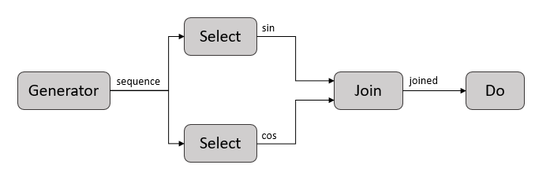
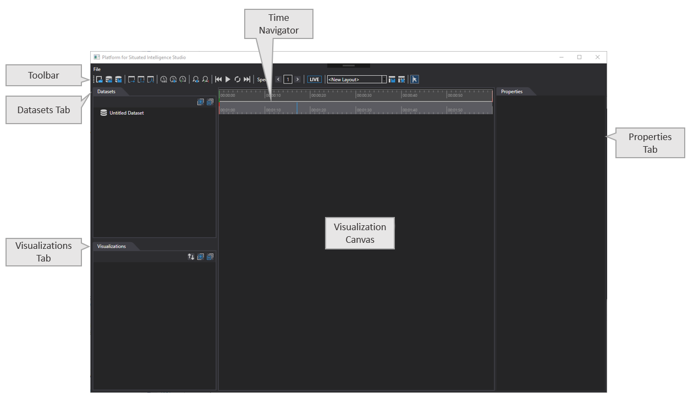
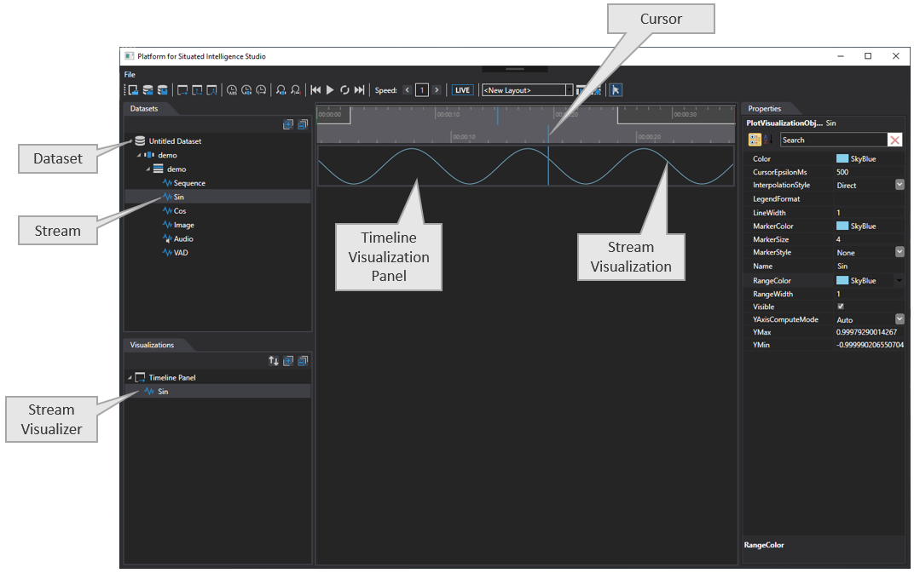
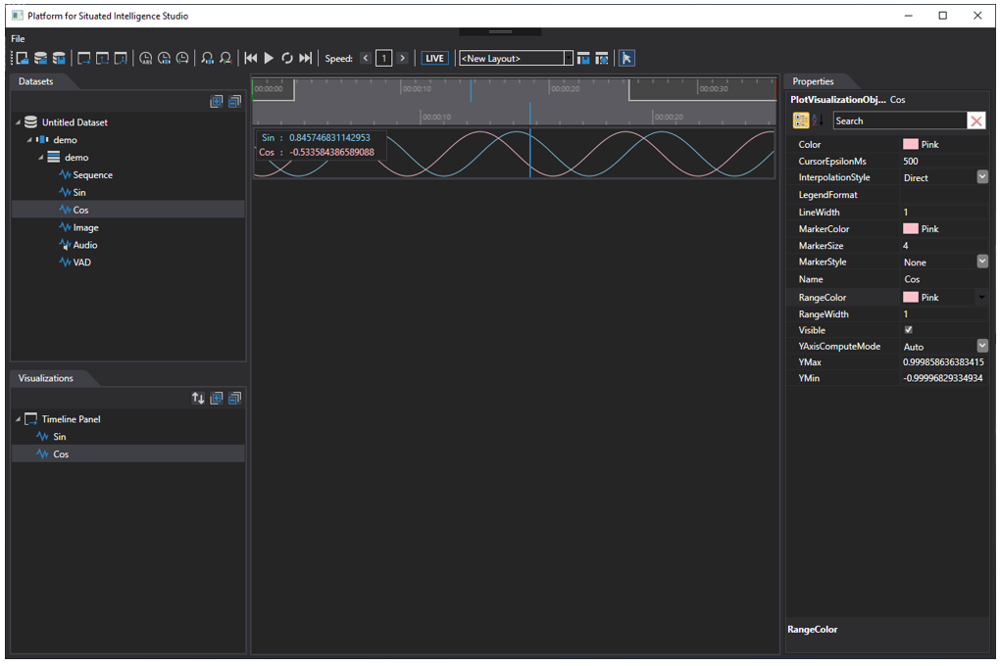
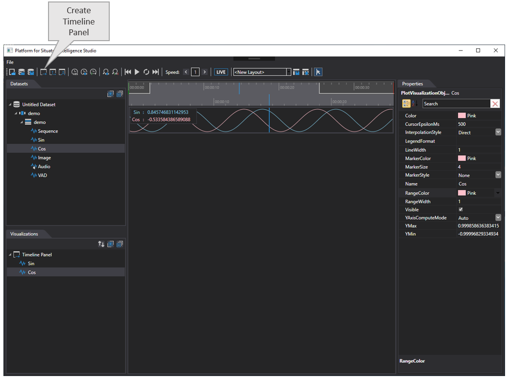
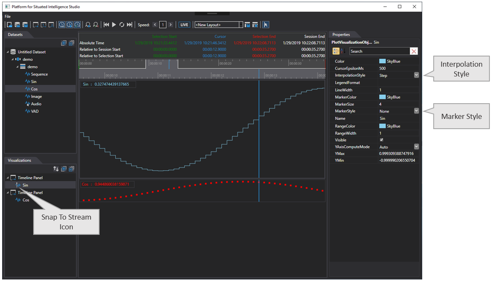
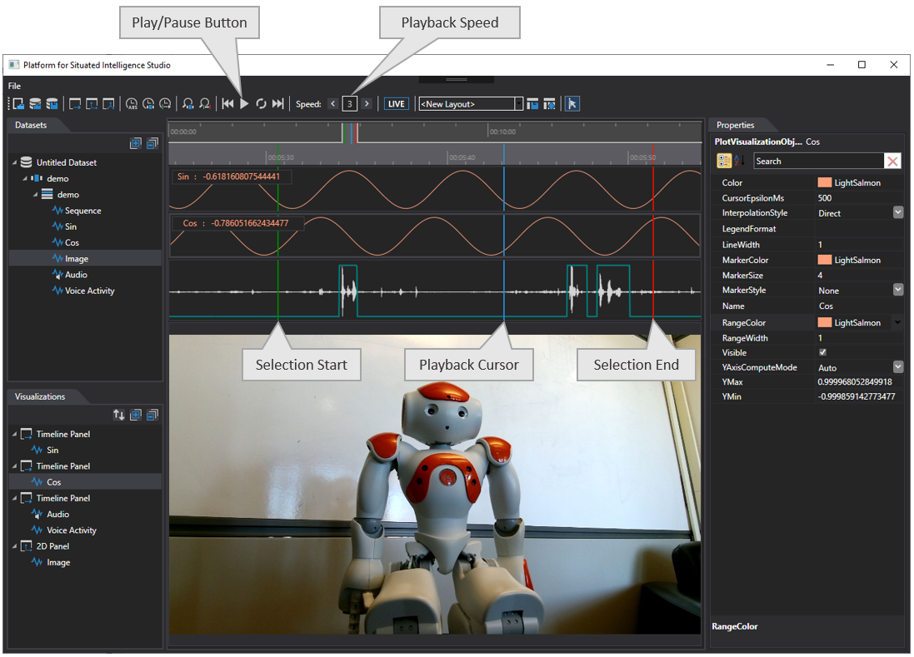
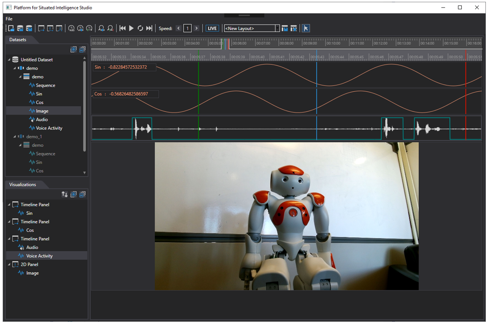
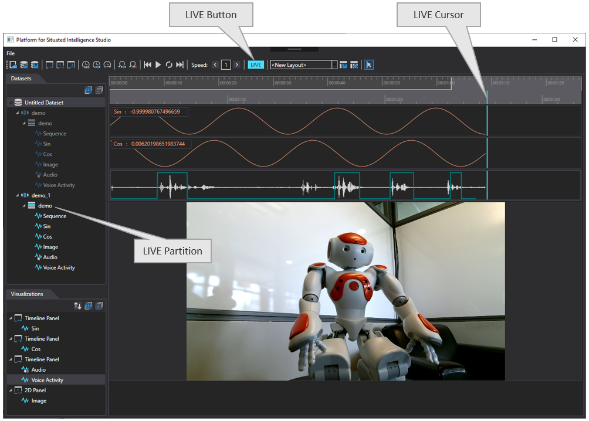

This tutorial is meant to help you get started with writing you own C# applications using the Platform for Situated Intelligence (or \\psi). Some of the topics that are touched upon here are explained in more depth in other documents.

The tutorial is structured in the following easy steps:

1. [**A simple \\psi application**](#SimpleApplication) - describes first steps in creating a very simple \\psi application.
2. [**Synchronization**](#Synchronization) - describes how to fuse and synchronize multiple streams.
3. [**Saving Data**](#SavingData) - explains how to persists streams to disk.
4. [**Replaying Data**](#ReplayingData) - explains how to replay data from a persisted store.
5. [**Visualization**](#Visualization) - explains how to use Platform for Situated Intelligence Studio (PsiStudio) to visualize persisted streams, or live streams from a running \\psi application.
6. [**Further Reading**](#FurtherReading) - provides pointers to further in-depth topics.

<a name="SimpleApplication"></a>

## 1. A simple \psi application

Before writing up our first \\psi app, we will need to setup a Visual Studio project for it. Follow these steps to set it up:

1. First, create a simple .NET Core console app (for the examples below, a console app will suffice). You can do so by going to _File -> New Project -> Visual C# -> Console App (.NET Core)_. (.NET Core is a cross-platform solution; if you want to createa .NET Framework solution which runs only on Windows, make sure you change your project settings to target .NET Framework 4.7 or above.)

2. Add a reference to the `Microsoft.Psi.Runtime` NuGet package that contains the core Platform for Situated Intelligence infrastructure. You can do so by going to References (under your project), right-click, then _Manage NuGet Packages_, then go to _Browse_. Make sure the _Include prerelease_ checkbox is checked. Type in `Microsoft.Psi.Runtime` and install.

3. As the final step, add a `using` clause at the beginning of your program as follows:

```csharp
using Microsoft.Psi;
```

You are now ready to start writing your first \\psi application!

A \\psi application generally consists of a computation graph that contains a set of components (nodes in the graph), connected via time-aware streams of data (edges in the graph). Most \\psi applications use various sensor components (like cameras, microphones) to generate source streams, which are then further processed and transformed by other components in the pipeline. We will start simple though, by creating and displaying a simple source stream: a timer stream that posts messages every 100 ms.

To do so, we start by creating the __pipeline__ object, which represents and manages the graph of components that make up our application. Among other things, the pipeline is responsible for starting and stopping the components, for running them concurrently and for coordinating message passing between them. To create the pipeline, we use the `Pipeline.Create` factory method, like below:

```csharp
static void Main(string[] args)
{
    using (var p = Pipeline.Create())
    {
    }
}
```

Now, let's add the logic for constructing the timer stream, and for displaying the messages on it:

```csharp
static void Main(string[] args)
{
    using (var p = Pipeline.Create())
    {
        var timer = Timers.Timer(p, TimeSpan.FromSeconds(0.1));
        timer.Do(t => Console.WriteLine(t));
        p.Run();
    }
}
```

Try it out!

The `Timers.Timer` factory method creates a source timer stream. In this case, the first parameter in the call is the pipeline object `p` (a common pattern in \\psi when instantiating components) and the second parameter is the time interval to use when generating messages is specified as the second parameter.

__*Streams*__ are a fundamental construct and a first-order citizen in the \\psi runtime. They can be generated and processed via various operators and they link components together. Streams are a generic type (you can have a stream of any type `T`) and are strongly typed, and therefore the connections between components are statically checked. Messages posted on streams are time-stamped and streams can be persisted to disk and visualized (more on that in a moment).

In the example above `Do()` is a __*stream operator*__, which executes a function for each message posted on the stream. In this case, the function is specified inline, via an anonymous delegate `t => Console.WriteLine(t)` and simply writes the message to the console. Under the covers, each stream operator is backed by a component: the `Do()` extension method creates a `Do` component that subscribes to the `Timer` component. In reality, the pipeline we have just constructed looks like this:


The delegate passed to the `Do` operator takes a single parameter, which corresponds to the data arriving on the stream. Another overload of the `Do` operator also gives access to the message envelope, which contains the time-stamp information. To see how this works, change the `timer.Do` line in the example above to:

```csharp
timer.Do((t, e) => Console.WriteLine($"{t} at time {e.OriginatingTime.TimeOfDay}"));
```

This time the timestamp for each message will be displayed. You may notice that the timestamps don't correspond to your local, wall-clock time. This is because \\psi messages are timestamped in UTC.

The `p.Run()` line simply runs the pipeline. A number of overloads and other (asynchronous) methods for running the pipeline are available, but for now, we use the simple `Run()` method which essentially tells the pipeline to execute to completion. This causes the generator to start generating messages, which in turn are processed by the `Do` operators. Since the generator outputs a timer stream that is infinite this application will continue running indefinitely until the console is closed by the user.

There are many basic, generic stream operators available in the \\psi runtime (for an overview, see [Basic Stream Operators](Stream-Operators), and also operators for processing various types of streams (like operators for turning a stream of color images into a corresponding stream of grayscale images). Besides `Do`, another operator that is often used is `Select`. The `Select` operator allows you to transform the messages on a stream by simply applying a function to them. Consider the example below (you will have to also add a `using System.Linq;` directive at the top of your program to access the `Enumerable` class):

```csharp
static void Main(string[] args)
{
    using (var p = Pipeline.Create())
    {
        var sequence = Generators.Sequence(p, 0d, x => x + 0.1, 100, TimeSpan.FromMilliseconds(100));
        sequence
            .Select(t => Math.Sin(t))
            .Do(t => Console.WriteLine($"Sin: {t}"));
        p.Run();
    }
}
```

Before we discuss the `Select`, note that we have used a different generator this time to create a source stream that outputs a sequence of values. The `Generators.Sequence` factory method creates a stream that posts a sequence of messages. In this particular case the sequence is specified via an initial value (`0d`), an update function (`x => x + 0.1`) and a total count of messages to be generated (`100`). The messages will be posted at 100 millisecond intervals. Note also that in this case, when we run the pipeline, the sequence and hence the source stream is finite, and as a result the pipeline will complete and the program will exit once the end of the sequence is reached.

The `Select` operator we have injected transforms the messages from the sequence stream by computing the sine function over the messages. Try this and check out the results! You should see in the console a sequence of outputs that fluctuate between -1 and +1, like the sinus function.

Beyond `Do` and `Select`, \\psi contains many operators: single stream operators like `Where`, `Aggregate`, `Parallel` etc. (similar with Linq and Rx), stream generators (`Sequence`, `Enumerate`, `Timer`) as well as operators for combining streams (`Join`, `Sample`, `Repeat`). Like `Do`, some of these operators also have overloads that can surface the message envelope information. Check out the [Basic Stream Operators](Stream-Operators) page for an in-depth look at all of them.

Finally, so far we have highlighted the language of stream operators, which encapsulate simple components that perform transformations on streams. In the more general case, \\psi components can have multiple inputs and outputs and can be wired into a pipeline via the `PipeTo` operator. For instance, in the example below we instantiate a wave file audio source component, and connect its output to an acoustic features extractor component, after which we display the results.

```csharp
using (var p = Pipeline.Create())
{
    // Create an audio source component
    var waveFileAudioSource = new WaveFileAudioSource(p, "sample.wav");

    // Create an acoustic features extractor component
    var acousticFeaturesExtractor = new AcousticFeaturesExtractor(p);

    // Pipe the output of the wave file audio source component into the input of the acoustic features extractor
    waveFileAudioSource.Out.PipeTo(acousticFeaturesExtractor.In);

    // Process the output of the acoustic features and print the messages to the console
    acousticFeaturesExtractor.SpectralEntropy.Do(s => Console.WriteLine($"SpectralEntropy: {s}"));
    acousticFeaturesExtractor.LogEnergy.Do(e => Console.WriteLine($"LogEnergy: {e}"));

    // Run the pipeline
    p.Run();
}
```

Writing a \\psi application will often involve authoring a pipeline that connects various existing components and processes and transforms data via stream operators. In some cases, you may need to write your own components. The [Writing Components](Writing-Components) page has more in-depth information on this topic. In addition, to optimize the operation of your pipeline, you may need to specify delivery policies to control how messages may be dropped in case some of the components cannot keep up with the cadence of the incoming messages. The [Delivery Policies](Delivery-Policies) page has more in-depth information on this topic.

<a name="Synchronization"></a>

## 2. Synchronization

Building systems that operate over streaming data often requires that we do stream-fusion, i.e., join data arriving on two different streams to form a third stream. Because execution of the various components in a \\psi pipeline is asynchronous and parallel, __*synchronization*__ becomes paramount, i.e., how do we match (or pair-up) the messages that arrive on the different streams to be joined?

The answer lies in the fact that \\psi streams are time-aware: timing information is carried along with the data on each stream, enabling both the developer and the runtime to correctly reason about the timing of the data. Specifically, the way this works is that the data collected by sensors (the data on source streams) is timestamped with an __*originating time* that captures when the data captured by the sensor occured in the real world. For instance, messages posted on the output stream of the video camera components will time-stamp each frame with the originating time of when that image frame was collected by the sensor. As the image message is processed by a downstream `ToGray()` component, the originating time is propagated forward on the resulting grayscale image message. This way, a downstream component that receives the grayscale image will know what was the time of this data in the real world. And, if the component has to fuse information from the grayscale image with results from processing an audio-stream (which may arrive at a different latency), because the component has access to originating times on both streams, it can reason about time and pair the streams.

To facilite this type of synchronization \\psi provides a special `Join` stream operator that allows you to fuse multiple streams and control the synchronization mechanism used in this process.

To illustrate this, let's look at the following example:

```csharp
using (var p = Pipeline.Create())
{
    var sequence = Generators.Sequence(p, 0d, x => x + 0.1, 100, TimeSpan.FromMilliseconds(100));

    var sin = sequence.Select(t => Math.Sin(t));
    var cos = sequence.Select(t => Math.Cos(t));

    var joined = sin.Join(cos);
    joined.Do(m =>
    {
        var (sinValue, cosValue) = m;
        Console.WriteLine($"Sum of squares: {(sinValue * sinValue) + (cosValue * cosValue)}");
    });
    p.Run();
}
```

The example computes two streams, containing the sin and cos values for the original sequence. The streams are then joined via the join operator: `sin.Join(cos)`. The join operator synchronizes the streams: the messages arriving on the sin and cos streams are paired based on matching originating times. The `Join` operator produces an output stream containing a C# tuple of double values, i.e. `(double, double)` - you can see this by hovering over the joined variable in Visual Studio. This is generally the case: when joining two streams of type `TA` and `TB`, the output stream will be a tuple of `(TA,TB)`.

Try the example out! You should be getting a printout that looks like:

```shell
Sum of squares: 1.0000
Sum of squares: 1.0000
Sum of squares: 1.0000
Sum of squares: 1.0000
```

The answer is always one. Yes, Pythagora's theorem still holds: sin ^ 2 + cos ^ 2 = 1. But there is in fact something more interesting going on here that we would like to highlight. The reason we get the correct answer is because the `Join` operator does the proper synchronization and pairs us the messages with the same originating time, regardless essentially of when they arrive (this is important because all the operators execute concurrently respective to each other). The pipeline from the example above contains 5 components, like this:



All of these components execute concurrently. The generator publishes the values, and these are sent to the two `Select` operators. These two operators publish independently the values computed but maintain the originating time on the messages that get sent downstream. The join operator receives the messages on two different streams. Because of concurrent execution, we do not know the relative order that the messages arrive over the two streams at the Join operator. For instance, one of the computations (say cosinus) might take longer which may create a larger latency (in wall clock time) on that stream. However, because originating times are carried through, `Join` can pair the messages correctly and hence the sin ^ 2 + cos ^ 2 = 1 equality holds over the output.

To more vividly demonstrate what would happen without this originating-time based synchronization, modify the join line like below:

```csharp
var joined = sin.Pair(cos);
```

Re-run the program. This time, the results are not always 1. In this case we have used a different operator, `Pair` that does not actually reason about the originating times but rather pairs each message arriving on the `sin` stream with the last message that was delivered on the `cos` stream. Because of asynchronous execution of operators in the pipeline, this time the pairing might not correspond to the a match in the originating times and in that case the result from summing up the squares is different from 1.

We have illustrated above how to do an _exact_ join (the originating times must match exactly for the messages to be paired). There are many ways to do originating-time based synchronization, with important consequences for the behavior of the pipeline. In this introductory guide, we limit this discussion here, but we recommend that you read the more in-depth topic on the [Synchronization](Synchronization) page.

<a name="SavingData"></a>

## 3. Saving Data

While the examples provided so far operate with synthetic data for simplicity, this is not generally the case. Usually, the data is acquired from sensors or external systems otherwise connected to the real world. In most cases we want to save the data for analysis and replay. \\psi provides a very simple way of doing this, as illustrated in the following example:

```csharp
using (var p = Pipeline.Create())
{
    // Create a store to write data to (change this path as you wish - the data will be stored there)
    var store = Store.Create(p, "demo", "c:\\recordings");

    var sequence = Generators.Sequence(p, 0d, x => x + 0.1, 100, TimeSpan.FromMilliseconds(100));

    var sin = sequence.Select(t => Math.Sin(t));
    var cos = sequence.Select(t => Math.Cos(t));

    // Write the sin and cos streams to the store
    sequence.Write("Sequence", store);
    sin.Write("Sin", store);
    cos.Write("Cos", store);

    Console.WriteLine("Program will run for 10 seconds and terminate. Please wait ...");
    p.Run();
}
```

The example creates and saves the _sequence_ and _sin_ and _cos_ streams of double values. This is done by creating a store component with a given name and folder path via the `Store.Create` factory method, and then using it with the `Write` stream operator. The store component knows how to serialize and write to disk virtually any .Net data type (including user-provided types) in an efficient way.

The data is written to disk in the specified location (in this case `c:\recordings`, in a folder called `demo.0000`. The `Store.Create` API creates this folder and increases the counter to `demo.0001`, `demo.0002` etc. if you run the application repeatedly. Inside the `demo.0000` folder you will find Catalog, Data and Index files. Together, these files constitute the store.

<a name="ReplayingData"></a>

## 4. Replaying Data

Data written to disk in the manner described above can be played back with similar ease and used as input data for another \\psi application. Assuming that the  example described in the [Saving Data](#SavingData) section was executed at least once, the following code will read and replay the data, computing and displaying the sin function.

```csharp
using (var p = Pipeline.Create())
{
    // Open the store
    var store = Store.Open(p, "demo", "c:\\recordings");

    // Open the Sequence stream
    var sequence = store.OpenStream<double>("Sequence");

    // Compute derived streams
    var sin = sequence.Select(Math.Sin).Do(t => Console.WriteLine($"Sin: {t}"));
    var cos = sequence.Select(Math.Cos);

    // Run the pipeline
    p.Run();
}
```

An existing store is opened with the `Store.Open` factory method, and streams within the store can be retrieved by name using the `OpenStream` method (you will have to know the name and type of the stream you want to access). The streams can then be processed as if they were just generated from a source.

This method of replaying data preserves the relative timing and order of the messages, and by default plays back data at the same speed as it was produced. When you run the program, you will see the Sin values being displayed by the `Do` operator.

We can control the speed of the execution of the pipeline, via a replay descriptor parameter passed to the `Run()` method. If noparameter is specified the pipeline uses the `ReplayDescriptor.ReplayAllRealTime`, which plays back the data at the same speed as it was produced. Try replacing the call to `p.Run()` with `p.Run(ReplayDescriptor.ReplayAll)`. In this case, the data will play backfrom the store at maximum speed, regardless of the speed at which it was generated. Running the program will display the Sin values much faster now. Note that the originating times are nevertheless preserved on the messages being replayed from the store.

<a name="Visualization"></a>

## 5. Visualization

Visualization of multimodal streaming data plays a central role in developing multimodal, integrative-AI applications. Visualization scenarios in \\psi are enabled by the __Platform for Situated Intelligence Studio__ (which we will refer to in short as PsiStudio)

__Notes__:
* Kinect for Windows SDK is required to run PsiStudio which can be found [here](https://www.microsoft.com/en-us/download/details.aspx?id=44561).
* Currently, PsiStudio runs only on Windows, although it can visualize data stores created by \\psi applications running on any platform supported by .NET Core.
* The tool is not currently shipped as an executable, so to use it you will need to build the codebase; instructions for building the code are available [here](Using.BuildingPsi). The tool is implemented by the `Microsoft.Psi.PsiStudio` project in the `Psi.sln` solution tree under `Sources\Tools\PsiStudio`. To run it, simply run this project after building it.

PsiStudio enables compositing multiple visualizers of different types (from simple streams of doubles to images, depth maps, etc.). In this section we will give a very brief introduction to this tool.

<a name="OfflineVisualization"></a>

### 5.1 Offline Visualization

For the rest of the samples in this tutorial we're going to add several more realistic streams to our project, for video, audio, and voice activity detection. To get the best out of this sample you'll need a webcam, but if you don't have one you can comment out the code below that references the MediaCapture, AudioCapture, and SystemVoiceActivityDetector components.

In your Visual Studio project, add the following NuGet references in the same way you did in the first section of this tutorial:

1. `Microsoft.Psi.Media.Windows.x64`
2. `Microsoft.Psi.Imaging.Windows`
3. `Microsoft.Psi.Speech.Windows`

Now add the following `using` statements to the top of your class:

```csharp
using Microsoft.Psi;
using Microsoft.Psi.Audio;
using Microsoft.Psi.Imaging;
using Microsoft.Psi.Media;
using Microsoft.Psi.Speech;
```

And finally, replace the body of your `Main()` method with the following:

```csharp
// Create the pipeline object.
using (var p = Pipeline.Create())
{
    // Create the store
    var store = Store.Create(p, "demo", "c:\\recordings");

    var sequence = Generators.Sequence(p, 0d, x => x + 0.1, 10000, TimeSpan.FromMilliseconds(100));

    var sin = sequence.Select(t => Math.Sin(t));
    var cos = sequence.Select(t => Math.Cos(t));

    // Write the sin and cos streams to the store
    sequence.Write("Sequence", store);
    sin.Write("Sin", store);
    cos.Write("Cos", store);

    // Create the webcam and write its output to the store as compressed JPEGs
    var webcam = new MediaCapture(p, 1920, 1080, 30);
    webcam.Out.EncodeJpeg(90, DeliveryPolicy.LatestMessage).Write("Image", store);

    // Create the AudioCapture component and write the output to the store
    var audio = new AudioCapture(p, new AudioCaptureConfiguration() { OutputFormat = WaveFormat.Create16kHz1Channel16BitPcm() });
    audio.Write("Audio", store);

    // Pipe the audio to a voice activity detector and write its output to the store
    var voiceActivityDetector = new SystemVoiceActivityDetector(p);
    audio.Out.PipeTo(voiceActivityDetector);
    voiceActivityDetector.Out.Write("Voice Activity", store);

    // Run the pipeline
    p.RunAsync();

    Console.WriteLine("Press any key to finish recording");
    Console.ReadKey();
}
```

As you can see from the code, in addition to generating our sine and cosine streams, we create a MediaCapture component whose output stream is encoded as JPEG images and then persisted to the store.  We also create an AudioCapture component whose output is similarly persisted to the store, and we pipe the output of the audio stream into a voice activity detector whose output is persisted to the store as yet another stream.

Now start your application, let it run for thirty seconds or so while standing in front of the camera and talking, then press any key to stop recording and exit.

Now start up PsiStudio. You will see a window that looks similar to the image below. To open a store, go to the _File_ -> _Open Store_ and navigate to the location you have specified in the example above, e.g. `C:\recordings\demo.####` (the last folder corresponds to the last run) and open the Catalog file, e.g. `C:\recordings\demo.####\demo.Catalog_000000.psi`. The PsiStudio window should now look like this:



The PsiStudio application has a toolbar, a time-navigator (more on that in a second) and a visualization canvas in the center. On the left hand side, you will find the Datasets tab at the top with the Visualizations tab below it.  On the right hand side is a Properties page that lets you view the properties of any object selected in either the Datasets or the Visualizations tab. When opening a store, PsiStudio automatically wraps a __*dataset*__ around it (more information on datasets is available in the [Datasets](InDepth.Datasets) page), with the name _Untitled Dataset_. Double-clicking on _Untitled Dataset_ will open up the underlying demo session and demo partition will reveal the set of streams available in the store, in this case Sequence, Sin, Cos, Image, Audio, and Voice Activity. Right-clicking on the Sin stream will bring up a popup-menu, and selecting _Plot_ will allow you to visualize the Sin stream.  Alternatively you can just drag the stream from the datasets tab onto the Visualization Canvas.  PsiStudio should now look like this:



The plot command has created a timeline visualization panel and inside it a visualizer for the Sin stream. Moving the mouse over the panel moves the data cursor (which is synchronized across all panels).

If we repeat the operation on the Cos stream, a visualizer for this stream will be overlaid on the current timeline panel, resulting in a visualization like this :



To display the legend that's visible in the image above, simply right click on the timeline panel and select _Show/Hide Legend_.

You will notice that as you move the cursor around over the timeline panel, the legend updates with the current values under the cursor. Navigation can be done via mouse: moving the mouse moves the cursor, and the scroll wheel zooms the timeline view in and out. As you zoom in, you will notice that the time navigator visuals change, to indicate where you are in the data (the blue region in the top-half).  You can also drag the timeline to the left or right to view earlier or later data in the stream.

As we have seen before, new visualizations will by default be overlaid in the same panel. Suppose however that we wanted to visualize the Cos stream in a different panel. Take a look at the Visualizations tab on the left,  notice that currently there is one timeline panel in the canvas. If you expand the _Timeline Panel_ item at the top of the hierarchy, you will see two stream visualizers underneath, for Sin and Cos, like below:



Right-clicking on the Cos visualizer brings up a context-menu that allows you to remove this visualizer. Try it out. This should make the Cos stream disappear from the panel. Next, click on the _Insert Timeline Panel_ button in the toolbar, highlighted in the image above. This will add a new timeline panel. Then, in the _Datasets_ tab, right-click on Cos and click _Plot_ again, the Cos stream will appear in the second (current) panel.  Alternatively, you can add a stream to a new panel by dragging it from the Datasets tab into any part of the Visualization Canvas that does not already contain a Visualization Panel.

You can use the mouse to drag the bottom edge of any visualization panel to change its height, and you can change the ordering of the panels by clicking inside any visualization panel and dragging it up or down.

Come back to the _Visualizations_ tab and highlight the Cos visualizer. In the _Properties_ tab on the right the set of properties for this visualizer are available for inspection and modification. You can change various properties of the visualizer, like the color of the line and the marker style to use. For instance, here we have changed the _LineColor_ and _MarkerColor_ properties to red, and the _MarkerStyle_ to Square:


On the toolbar are three _Timing Display_ buttons that can be used to display timing information above the _Time Navigator_.  The first button displays absolute times, the second displays times relative to the start of the session, and the third button displays times relative to the selection start marker (selection markers are described in the [Data Playback](#DataPlayback) section below).  The picture below shows what the PsiStudio application looks like with all three timing displays activated, but typically a user would only have a single display activated at any given time.  As the user moves the cursor within the navigation area, the timing display is updated to show the time at the cursor, the time relative to the selection start and selection end markers, and the time relative to the end of the session.


You can also change how a stream is rendered.  In the picture below the Interpolation Style property of the Sin stream has been changed to _Step_ which renders the stream so that it maintains its current value until the next message is received.  For the Cos stream the Interpolation Style property has been changed to _None_ so that only the values of the messages are displayed and no connecting lines are drawn between them.  When using this valule for Interpolation Style the Marker Style property must be changed to something other than _None_ or nothing at all will be rendered.  Notice in the picture below that the Visualization Panel for the Sin stream has been resized by dragging its bottom edge in order to get a better view of the data.

Notice also that _Snap to Stream_ has been enabled on the Sin stream so that the Cursor always snaps to the message nearest to the mouse.  If one or more of the timing displays is activated, then the user can find the exact time of any message in the stream by moving the cursor near it.  To enable _Snap to Stream_, right-click the stream you wish to snap to in the Visualizations tab and select _Snap to Stream_ in the context menu.  The stream that is currently being snapped to will display an additional magnet icon next to it in the Visualizations tab.  To cancel _Snap to Stream_, right-click the stream in the Visualizations tab and again select the _Snap to Stream_ menu item.



<a name="DataPlayback"></a>

### 5.2 Data Playback

In PsiStudio you can not only view data streams, you can also play them back at whatever speed you choose. This can be useful for viewing output that contains video streams.

Create a new visualization panel by clicking the _Insert Timeline Panel_ button and add the _Audio_ stream and also the _Voice Acitvity_ stream to it.  Notice that having two related streams in the same visualization panel makes it easy to see how they relate to each other; overlaying the voice activity detection stream over the audio, we can see at a glance that the VAD is correctly identifying speech regions.

In the _Datasets_ tab, right-click on the _Image_ stream and select _Visualize_ from the context menu to display the video stream.  You PsiStudio window should now look like the picture below.  Notice that the image visualizer is synchronized to the timeline, as you move the cursor within any of the timeline visualization windows, the video stream shows the image that was captured at that point in time.

There are three _Cursor Modes_ in PsiStudio, and up until now we have been using the _Manual_ cursor mode, where the cursor follows the user's mouse pointer and will display images and data values at whatever point in time the user places his mouse.  Now we'll demonstrate the second cursor mode, known as _Playback Mode_, and it is engaged whenever we play back our data within some time interval.

Use your mouse wheel to zoom into an interesting part of the audio timeline, and ensure that Legends are switched on (right-click on a visualization panel and select _Show/Hide legend_).

Now hold down the _Shift_ key and click somewhere near the left of the visualization window.  A green _Selection Start_ marker will be placed at the mouse's position.  Still holding down the _Shift_ key, right-click somewhere near the right of the visualization window and a red _Selection End_ marker will be placed.

Now click the _Play/Pause_ button in the toolbar and the data will be played back from the _Selection Start_ marker to the _Selection End_ marker.  You can vary the playback speed by clicking on the _Increase Playback Speed_ and _Decrease Playback Speed_ buttons.  The video image stream will be synchronized to the cursor's position in the audio stream, and the legend will display the data values at the cursor as the streams are played back.



<a name="LiveVisualization"></a>

### 5.3 Live Visualization

While so far we have discussed how to use PsiStudio to visualize previously collected data, the tool can also be used to connect to a store that is currently being written to by a running \\psi application and visualize the streams in real time.

For this example we'll be using exactly the same code we wrote in the previous section, so start the application running again, and let it continue to run in the background collecting data.

Since you just restarted your \\psi application, it's generating a new dataset in a new subdirectory, and if you still have PsiStudio open from the last tutorial section you'll still be viewing the _previous_ session.  To view the new session being created, right-click on the top-level node called _Untitled Dataset_ in the _Datasets_ tab and from the context menu select _Create Session from Existing Store..._, then in the File Open dialog go up one level to `C:\recordings` and then into the _latest_ `demo.####` subdirectory.  Since this is a live store, you can tell that you're in the correct subdirectory because all of the files' _Date modified_ attributes will be the current date and time.  If you've opened the store of the currently running \\psi application, then PsiStudio should look like this:



We now have two sessions loaded, the previous session (which we can tell is the session being displayed in the Visualizations area because all of the tree nodes under it are white), and the new Live session. Notice that PsiStudio detected that the store that we opened was live, and it added a _Live_ icon next to the partition name and all of the streams in that parition.  Notice also that it generated a new name for the session _demo_1_ to ensure that all sessions in our dataset have unique names.

To switch to visualizing the live session, right-click on the _demo_1_ session and from the context menu select _Visualize Session_.

After PsiStudio switched to the new session it automatically rebound all of the visualizers in the Visualizations area to the streams in the new session.

Because we've switched to visualizing a live session, PsiStudio pressed the _LIVE_ Button on your behalf to set the cursor mode to _Live_. Also notice that in this mode the timeline is automatically scrolling to keep up with new messages being written to the store.

PsiStudio will monitor this partition so that any new streams that the app writes will be automatically added to the _Datasets_ tree view. PsiStudio will also detect when your \\psi application stops writing to the store and will switch the cursor mode from _Live_ mode back to _Manual_ mode, and the _Live_ icons next to the streams will disappear.



Now we can see the third cursor mode, called _Live_ mode in action.  When in this mode the cursor will stay in a fixed position in the visualizations window while the streaming data scrolls past.  You can still use the mouse wheel to zoom in or out of the data while in _Live_ mode.  Notice that the trace for the Voice Activity Detector lags the other streams by a couple of hundred milliseconds, since that's how long it took that componemt to process its messages.

Even as the application continues to run you can switch back at any time to _Manual_ cursor mode by unclicking the _LIVE_ button in the toolbar.  When you do this, the visualization window will stop scrolling even as new data continues to be written to the store and you regain control of the cursor with the mouse.  You can now drag and zoom the timeline with the mouse and position the cursor anywhere you'd like on the timeline in order to examine older messages.  You can also set the _Selection Start_ and _Selection End_ markers and use the _Play/Pause_ button to replay a portion of the timeline.

Clicking the _Live_ button once more will switch the cursor mode back into _Live_ mode; the cursor will catch up with the latest live messages being written to the store, and the timeline will begin automatically scrolling again as new messages are received.

<a name="FurtherReading"></a>

## 6. Next steps

Besides this brief introduction, a couple of additional [tutorials](Basic-Tutorials) are available, as well as a number of more [advanced, in-depth topics](More-Advanced-Topics) that dive into more details in various aspects of the framework, including [stream operators](Stream-Operators), [synchronization](Synchronization), [shared objects and memory management](Shared-Objects), [remoting](Remoting), [interop](Interop) etc.

Apart from the documentation, it may be helpful to look through the set of [Samples](Samples) provided. While some of the samples address specialized topics like how to leverage speech recognition components or how to bridge to ROS, reading them will give you more insights into programming with Platform for Situated Intelligence.
