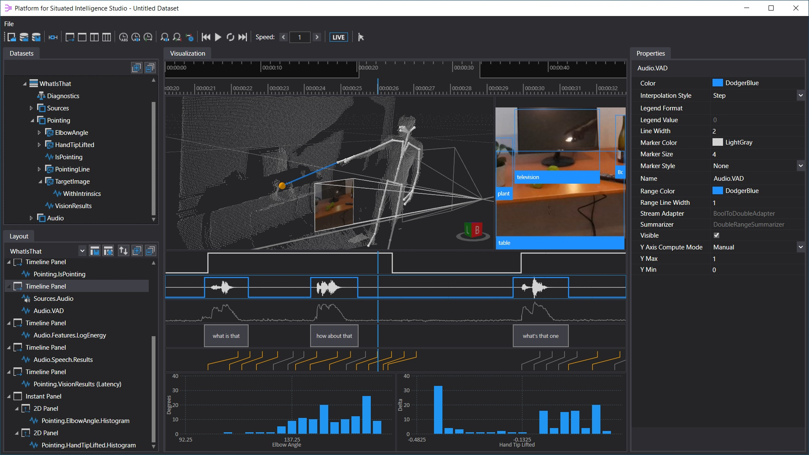

# Welcome

The wiki contains the main documentation pages for Platform for Situated Intelligence. Please use the sidebar to the right to navigate. If you would like to make edits, please fork and send a pull request.

# A Quick Overview

__Platform for Situated Intelligence__ (which we abbreviate as \\psi, pronounced like the greek letter) is __an open, extensible framework that accelerates research and development of multimodal, integrative-AI systems__. These are systems that operate with different types of streaming data, e.g. video, audio, depth, IMU data, etc., and leverage multiple component technologies to process this data at low latency. Example range from systems that sense and act in the physical world, such as interactive robots, drones, virtual interactive agents, personal assistants, interactive instrumented meeting rooms, to software systems that mesh human and machine intelligence, all the way to applications based on small devices that process streaming sensor data. 

Despite significant progress over the last few years in sensing, perception, and control, building multimodal, integrative-AI systems that can perceive, reason about and act in the open world remains a challenging, error-prone and very time-consuming engineering task. Many challenges stem from the sheer complexity of these systems and are amplified by the lack of appropriate infrastructure and development tools.

Platform for Situated Intelligence addresses these challenges and provides a robust basis for development and research multimodal, integrative-AI systems. Concretely, the framework provides an **infrastructure** for working with multimodal, temporally streaming data, a set of **tools** to support development, debugging, and maintenance, and an ecosystem of **components** that simplifies application writing and facilitates technology reuse. 

**Infrastructure**. \\psi provides a _runtime_ and a modern _streaming infrastructure_ that are specifically tailored and optimized for the needs of multimodal, integrative AI applications. Time is a first-order citizen in the framework. The runtime is optimized for low-latency from the bottom up, and provides abstractions for working with streaming data, reasoning about time, and performing time-related streaming operations such as synchronization, data fusion, windowing, etc. The infrastructure also supports fast persistence of generic data streams, enabling data-driven development scenarios.

**Tools**. \\psi provides a powerful set of tools that enable testing, data visualization, data annotation, replay, analytics and machine learning development for integrative-AI systems. The visualization subsystem allows for live and offline visualization of streaming data. A set of data processing APIs allow for re-running algorithms over collected data, data analytics and feature extraction for machine learning. The image below illustrates the multimodal visualization tool included in the framework.

**Components**. \\psi provides an open ecosystem of components, wrapping a variety of technologies. \\psi applications can be easily developed by wiring together such components, and new components can be easily authored. The [initial set of components](List-of-Components) focuses on multimodal sensing and processing, and includes sensor components for cameras and microphones, audio and image processing, speech, language, vision, as well as components that wrap cloud services (e.g., Azure Cognitive Services) or ML models (e.g., ONNX). We to further broaden this ecosystem with community contributions.

For more information about upcoming features, see the [Roadmap](Roadmap) document.
