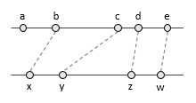
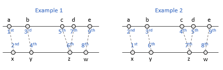

Platform for Situated Intelligence provides a set of stream operators and interpolators that allow the developer to easily implement a variety of stream fusion, merging and synchronization operations. This document describes these mechanisms.

__Note__: Prior to reading this document, we strongly recommend that you familiarize yourself with the core concepts of the \\psi framework, by reading the [Brief Introduction](Brief-Introduction) tutorial. The concepts of streams and originating times are a prerequisite for the documentation below.

The document is structured as follows:

1. [**Fusion versus Merging**](#FusionAndMerging) - introduces the basic concepts of stream _fusion_ and _merging_ and the difference between the two.
2. [**Stream Fusion: Interpolators**](#Interpolators) - describes _interpolators_, which are a core construct enabling stream fusion and synchronization.
3. [**Stream Fusion: Components and Operators**](#Components) - describes existing components and stream operators for performing stream fusion.
4. [**Stream Merging**](#Merging) - describes existing components and stream operators for performing stream merging.

<a name="FusionAndMerging"></a>

# 1. Stream Fusion versus Stream Merging

Suppose that we have two streams _s1_ and _s2_ that produce messages, as illustrated in the figure below. These might be streams of the same type, or of different types (say audio and video), each with their own (not necessarily equal or even constant) cadence.


A *__fusion__* operation takes two such streams as input (as we shall see later, this can be generalized to more than two), and produces a single output stream. Each output message is constructed by fusing a pair of messages from the input streams. In general, the type of the output messages might be different than the type of the inputs: each output get generated by applying a function to a pair of inputs. Since the messages arrive on the two input streams on their own timing, the fundamental problem the fusion component has to resolve is therefore _how to pair_ the messages on the two input streams. We discuss this question, and fusion stream operators (`Fuse` and `Join`) in [sections 2](#Interpolators) and [3](#Components) below.

In contrast, a *__merging__* operation combines streams of the same type. If in fusion the output messages are generally of a different type, a merging operation simply outputs the incoming messages one by one on the resulting stream, as illustrated by the figure below.


Evidently, in this case the input and output streams are of the same type. As with fusion, since the incoming messages arrive with different latencies on the input streams, various options are available in terms of ordering these messages on the output stream. We discuss this, and the corresponding stream merging operators (`Merge` and `Zip`) in [section 4](#Merging) below.

<a name="Interpolators"></a>

# 2. Stream Fusion: Interpolators

As we have seen above, a central question that arises in a fusion operation is how to pair the input messages. Certain applications might have different requirements around how this pairing should be done. For instance in one case we might want to pair messages from _s1_ with the closest message in originating time from _s2_ (this pairing is illustrated in the figure above); in another case we might want to pair it with the last message available on _s2_, and so forth. In \\psi, this pairing problem is resolved via _interpolators_, which we describe below.

An **_interpolator_** specifies how a generate a new message at a given interpolation time, from a stream of messages. The \\psi framework provides a number of such interpolators, and new ones can also be created. For instance, one of the simplest interpolators, called `Reproducible.Nearest`, generates as an interpolation result the nearest message to the interpolation time. If we use this interpolator over the messages shown in the figure below to interpolate at the time shown as _t_, the interpolation result would be message __z__. The `Reproducible.Nearest` interpolator simply selects a message from the existing stream, but in general an interpolator can create new messages (e.g., a linear interpolator between two points).


Fusion components (such as `Fuse` and `Join` discussed later) fuse data from a **_primary_** stream with a **_secondary_** stream by applying a specified interpolator: for every message received on the primary stream, the interpolator is called over the secondary stream to produce a message that the primary message should be paired with. For example, the pairing that results when fusing _s1_ as a primary stream with _s2_ as a secondary stream, using the `Reproducible.Nearest` interpolator is illustrated below:


Notice that for each message on the primary stream one (or possibly zero) messages may be produced on the output, fused stream. At the same time, a message on the secondary stream may be used multiple times in the fusion process. For instance, in the example above, __z__ was the nearest message on the secondary stream for both __c__ and __d__.

## 2.1. Interpolation Windows

By default, the `Reproducible.Nearest` interpolator we have introduced above looks for the nearest message on the entire secondary stream. The interpolator can be customized however with an optional parameter that specifies a time window or time tolerace, relative to the interpolation time, that should be considered when looking for the nearest match.

Relative time windows are represented via the `RelativeTimeInterval` class, which provides a number of constructors and static methods that enable creating a variety of relative time windows, shown in the table below.

| Expression | Relative time window | 
| :-- | :-- |
| `RelativeTimeInterval.Infinite` | (-∞, +∞) |
| `RelativeTimeInterval.Empty` | (0, 0) |
| `RelativeTimeInterval.Zero` | [0, 0] |
| `RelativeTimeInterval.Past()` | (-∞, 0] |
| `RelativeTimeInterval.Future()` | [0, +∞) |
| `new RelativeTimeInterval(TimeSpan.FromSeconds(-2), TimeSpan.FromSecond(3))` | [-2, 3] |
| `new RelativeTimeInterval(TimeSpan.FromSeconds(-5), true, TimeSpan.Zero, false)` | [-5, 0) |

For instance, if we wish to select the nearest message _before_ time _t_, we can construct a relative time window that from minus infinity (e.g. infinite past) to zero (e.g., present moment) via `RelativeTimeInterval.Past()`. Interpolating at time _t_ with a `Reproducible.Nearest(RelativeTimeInterval.Past())` in the figure below selects message __y__, as this is the closest message to time _t_, when looking in the past. 


If we use a `Reproducible.Nearest(RelativeTimeInterval.Past())` interpolator to fuse the streams _s1_ and _s2_, the pairing that results is illustrated below -- each message on the primary stream _s1_ is paired with the previous message on _s2_:



Instead of relative time intervals, an optional time tolerance parameter can also be specified as a `TimeSpan`, and is automatically converted into a symmetric relative time interval, for instance: 

    Reproducible.Nearest(TimeSpan.FromSeconds(1)))

is equivalent to:

    Reproducible.Nearest(new RelativeTimeInterval(TimeSpan.FromSeconds(-1), TimeSpan.FromSeconds(1)))

## 2.2. Basic Interpolators: `Exact`, `Nearest`, `First`, and `Last`

The list of interpolators extends well beyond the `Reproducible.Nearest` interpolator discussed above. Interpolators are implemented as classes that derive from `Interpolator<TIn, TResult>` and most of them are directly accessible via static factory methods on the `Reproducible` and `Available` classes, as shown in the table below: 

| Interpolator | Description | 
|:--|:--|
| Reproducible Interpolators | | 
| `Reproducible.Exact()` | Selects the message with the same originating time as the interpolation time. |
| `Reproducible.Nearest<T>(...)` | Selects the nearest message (within a relative time interval or time tolerance) to the interpolation time. | 
| `Reproducible.First<T>(...)` | Selects the first message (within a relative time interval or time tolerance) to the interpolation time. | 
| `Reproducible.Last<T>(...)` | Selects the last message (within a relative time interval or time tolerance) to the interpolation time. | 
| `Reproducible.Linear(...)` | Produces an interpolation result over a stream of doubles by linear interpolation between the messages before and after the interpolation time. |
| `AdjacentValuesInterpolator(...)` | Produces an interpolation result over a generic stream by applying a user-specified function to the messages adjacent (before and after) to the interpolation time. (The linear interpolator above is based on this adjacent values interpolator.) |
| Greedy Interpolators | | 
| `Available.Exact()` | Selects from the messages already available on the interpolation stream the message with the same originating time as the interpolation time. |
| `Available.Nearest<T>(...)` | Selects from the messages already available on the interpolation stream the nearest message (within a relative time interval or time tolerance) to the interpolation time. | 
| `Available.First<T>(...)` | Selects from the messages already available on the interpolation stream the first message (within a relative time interval or time tolerance) to the interpolation time. | 
| `Available.Last<T>(...)` | Selects from the messages already available on the interpolation stream the last message (within a relative time interval or time tolerance) to the interpolation time. | 

The `Nearest`, `First` and `Last` interpolators from the table above also come in an `OrDefault` flavor, e.g. `NearestOrDefault`, `FirstOrDefault`, `LastOrDefault` (not shown in the table for compactness). When a `Nearest`, `First` or `Last` interpolator does not find a corresponding match for a primary message (e.g. there is no matching secondary message in the specified interpolation window, etc.), no message will be produced on the output stream for that primary message. With the `OrDefault` version a default secondary stream value will be produced instead in this case. For instance, the Figure below shows the results over our example streams _s1_ and _s2_, when using `Reproducible.Nearest(RelativeTimeInterval.Past())` versus `Reproducible.NearestOrDefault(RelativeTimeInterval.Past(), '0')`. The default value to be used can be specified by the developer, or it itself defaults to `default(T)`.

## 2.3. Reproducible versus Greedy interpolators

As the table above indicates, the interpolators in the \\psi framework are divided into two broad categories: called **_reproducible_** interpolators and **_greedy_** interpolators. The important difference between these two classes is that the _reproducible_ interpolators will always generate the same _provably-correct_ result, regardless of the arrival time of the messages, whereas the _greedy_ ones do not provide this guarantee. This is a very important point, as it significantly changes the behavior of data fusion -- we discuss it in depth below. 

To explain the difference between _reproducible_ and _greedy_ interpolators, let's look back at a concrete example involving the streams _s1_ and _s2_ we have introduced earlier. In the figures above we have illustrated the messages on a horizontal time axis, at the position corresponding to their _originating times_. Note however that these messages might arrive with arbitrary latencies. And, while they will always appear in the order of the originating times on an individual stream, _the arrival order might be different across streams_ because of the delays with which the message arrive.

Consider for instance the two examples below. 


Each shows the same messages with the same originating times, but appearing in different orders. In example 1, __a__ appears (1st), then __x__ (2nd), then __b__ (3rd), __y__ (4th), __c__ (5th), __z__ (6th), __d__ (7th), __w__ (8th) and finally __e__ (9th). In this case the messages appear across streams actually in increasing originating time order. This however is most often not the case, as the example on the right-hand side shows. In this example , __x__ appears (1st), then __a__ (2nd), __b__ (3rd), and __c__ (4th) appear, followed by __y__ (5th), then __d__ (6th), then __z__ (7th) and __w__ (8th), and finally __e__ (9th).

The _reproducible_ interpolators will produce the same result, regardless of the order in which the messages appear on the two streams. In contrast, let's look the other, greedy version of the "nearest" interpolator, called `Available.Nearest`. This interpolator also selects the message nearest in originating time to the primary message, but it does so by looking only at the messages that are currently available on the secondary stream when the interpolator is first queried (e.g. when the primary message arrives) -- hence the name _greedy_. In contrast, the `Reproducible.Nearest` interpolator will potentially "wait" for new messages until it accumulates enough evidence that it has the correct answer, no matter what other messages might arrive on the secondary stream.

As a result, performing fusion via the `Reproducible.Nearest` interpolator will produce the same set of pairs for both examples above: __(a,x)__, __(b,y)__, __(c,z)__, __(d,z)__, __(e,w)__. 



In contrast, the results produced by the `Available.Nearest` operator depend not just on the originating times, but also on the order of arrival across streams that is induced by the latency of the messages. In example 1, the `Available.Nearest` interpolator will produce: __(b,x)__, __(c,y)__, __(d,z)__, __(e,w)__. Note that in this example no output is generated corresponding to the primary stream message __a__, as no secondary message is already available at the time __a__ arrives. In example 2, the output of `Available.Nearest` will again be different: __(a,x)__, __(b,x)__, __(c,x)__, __(d,x)__, and __(e,w)__.


## 2.4. Reproducibility and Correctness versus Latency

There is a fundamental tradeoff between the _reproducible_ and _greedy_ interpolators: _reproducible_ interpolators will produce the correct results in terms of originating time regardless of the latency at which the messages arrive, but they do so at the potential cost of introducing more latency. This is the case because the _reproducible_ interpolators have to see enough messages on the secondary stream to guarantee that the result they output will never change, regardless of what else might appear in the future on the secondary stream. 

For instance, in the situated from example 2 we have shown above (see again below), at the time message __c__ arrives on the primary, the only message available on the secondary stream is __x__, and this is the nearest message at this point in time. However, at this point in time the interpolator "knows" that other messages might arrive on the secondary stream that might be even closer in originating time, so it does not create an output. The interpolator waits in essence until it sees a message __z__ in this case. Once __z__ appears, it is clear that no future messages arriving on the secondary stream will change the answer, and an output is created. Note however that in the meantime other messages have arrived (__d__ and __y__), including even messages on the primary stream (__d__) -- the fusion components are queuing these messages and will process them later on. In effect, in the case above, to generate an interpolation result for __c__ we have to wait until __z__ arrives. As a consequence _the cadence and latency of the secondary stream dictates the latency of the interpolation result and fusion process_. 

In contrast the greedy, `Available.*` version of the interpolators produce the result right away, as the primary message arrives, but they only take into account what is present at that moment on the secondary stream, and as such might generate less precise, and generally non-reproducible results. They however do not incur the latency of the messages on the secondary stream.

<a name="Components"></a>

# 3. Stream Fusion: Components and Operators

## 3.1. Basic Fusion Components and Operators

Having introduced the various types of interpolators above we now finally turn attention back to data fusion. Data fusion in \\psi can be accomplished via one of two data fusion components and corresponding sets of stream operators: `Fuse` and `Join`. Both components use interpolators to determine how messages on a secondary and primary streams are paired and used together to generate a fused result. 

`Fuse` is the most general data fusion component/operator, and can use any type of interpolator. In contrast, `Join` is a component that derives off of `Fuse`, and only allows for using _reproducible_ interpolators. The distinction was introduced as a way to syntatically highlight in the code written when a reproducible fusion is performed versus not, i.e. `Join` means reproducible.

Other than this distinction, the usage for these two operators is very similar, and is illustrated below with a few examples, based on `Join`.

The basic syntax for joining two streams is: 

```csharp
var joined = primary.Join(secondary);
```

In this case, `primary` and `secondary` are the primary and secondary streams respectively. `Join` is a stream operator that applies to the primary stream, and takes as a first parameter the secondary stream. If no interpolator is specified, as in the example above, `Join` assumes by default the `Reproducible.Exact` interpolator -- this requires that the messages in the secondary stream align _exactly_ in originating time with the primary stream messages. However, an interpolator can be specified by the developer, either directly:

```csharp
var joined = primary.Join(secondary, Reproducible.Nearest(RelativeTimeInterval.Past()));
```

or by providing a relative time interval or a time tolerance, in which case a `Reproducible.Nearest` interpolator with that corresponding time window is assumed:

```csharp
var joined = primary.Join(secondary, RelativeTimeInterval.Past());
```

By default, in the examples aboved the `joined` stream will be a stream of tuples of elements `(p, s)`, where `p` is an element from the primary stream and `s` is an element from the secondary stream. Alternatively, `Join` and `Fuse` accept as an optional parameter a _fusion-function_ that maps the paired values to a different output type. For instance, if `primary` and `secondary` are two integer streams:

```csharp
var joined = primary.Join(secondary, RelativeTimeInterval.Past(), (p, s) => p + s);
```

will construct a `joined` stream of integers, where each fused integer output is the sum of the two inputs.

Finally, `Join` and `Fuse` also accept two additional parameters named `primaryDeliveryPolicy` and `secondaryDeliveryPolicy` which control the [delivery policies](Delivery-Policies) on the primary and secondary stream connections. By default, the pipeline-level delivery policy will be used. 

## 3.2. Tuple-flattening Fusion

When sequentially fusing multiple streams without explicitly specifying a fusion-function, the end result would naturally be a tuple of tuples. For example, `a.Join(b).Join(c).Join(d)` would produce a tuple of the form `(((a, b), c), d)`. This was deemed unwieldy, and to remedy it, a number of versions of `Join(...)` and `Fuse(...)` operators are available for streams of the type `IProducer<ValueTuple<...>>` which produce _flattened_ tuples up to an arity of 7. This way `a.Join(b)` produces `(a, b)` but then `.Join(c)` produces `(a, b, c)` and further `.Join(d)` produces `(a, b, c, d)`. We refer to this as _tuple-flattening_.

A stream of scalar (or otherwise non-tuple) values joined with a stream of `ValueTuple<...>` _also_ produces a flattened tuple stream. That is, aside from `a.Join(b).Join(c).Join(d)` producing `(a, b, c, d)` as above, the following does as well:

```csharp
var cd = c.Join(d); // (c, d)
var bcd = b.Join(cd); // (b, c, d)
var abcd = a.Join(bcd); // (a, b, c, d)
```

## 3.3. Vector Fusion

Another version of the `Join` and `Fuse` operators enable _vector fusion_. Vector fusion operates with a single primary stream (`IProducer<TPrimary>`), as usual, but with a sequence of secondary streams. That is, an enumeration of secondary streams (`IEnumerable<IProducer<TSecondary>>`) can be provided. All the secondary streams must have the same type. A fusion-function mapping from a pair of `TPrimary` and `TSecondary[]` to a new, fused output type must be provided. 

Based on this vector-fusion version, `Join` and `Fuse` overloads are also available that simply take as input a single array of streams of a given type, and fuse them in a vector. For example, assuming `streams` is an enumeration of streams, i.e. `IEnumerable<IProducer<T>>`:

```csharp
var vectorStream = Operators.Join(streams, Reproducible.Nearest());
```

the resulting `vectorStream` will be a stream of vectors of type `T`, i.e. `IProducer<T[]>`. This is implemented by using the first stream in the `streams` enumeration as a primary, and all the other streams as secondary streams in a vector-fusion operation.

## 3.4. Pair

Apart from `Fuse` and `Join`, the `Pair` operator can also be used to perform data fusion, but mostly exists for historical reasons and might be deprecated in the future. 

`Pair` behaves in essence like a `Fuse` with a greedy `Available.LastOrDefault()` interpolator: as soon as primary message is received, it will pair it with the last received secondary message, and output the corresponding tuple. Like with `Fuse` and `Join`, overloads are available to perform tuple flattening, and also to allow specifying a fusion function and primary and secondary delivery policies.

<a name="Merging"></a>

# 4. Stream Merging

Having discussed stream fusion, we now turn attention to merging. Recall that in a merging operation, the inputs and outputs have the same type and the output stream will essentially contain the messages from all input streams. 


There are two operators that enable stream merging in the \\psi framework: `Merge` and `Zip`.

## 4.1. Reproducible Merging with `Zip` 

The `Zip` operator merges two or more streams, based on the originating time of the incoming messages, and regardless of the latencies of arrival. `Zip` is therefore _reproducible_. As we have seen in the example 2 above, messages do not necessarily arrive in originating time order across streams. For instance, below the __x__ message is received first, even though its originating time is larger than that for message __a__. However, `Zip` knows that it cannot immediately post __x__ and caches it until the appropriate time to post. The messages are posted by `Zip` in originating time order, as illustrated below.


Because `Zip` is reproducible, same tradeoff between latency and reproducibility we have discussed with `Join` and reproducible interpolators arises here: before posting a specific input message, the operator needs to receive enough messages on its input streams to guarantee that no other message could appear with on originating time smaller than the one for the message to be posted. For instance, in the example above, `Zip` only posts __x__ after it has received __x__, __a__ and __b__ (only once __b__ is seen we know for sure that no other message will arrive on the first stream with an originating time smaller than that of __x__).

Finally, we note that the `Zip` operator produces messages of type `T[]`, rather than just `T` (where `T` is the input type). In general, the array contains a single element with the input message. However, if messages arrive on the two (or more) input streams with the exact same originating time, they will be collated into an array and posted together, at that originating time (recall that in \\psi we cannot post multiple messages with the same originating time on a stream).

## 4.2. Fast Merging with `Merge`

In constrast to `Zip`, the `Merge` operator posts incoming messages as they arrive, and therefore incurs no latency. However, to handle the fact that messages on the incoming streams might arrive out of originating-time order (across streams), the `Merge` operator posts on the output a message that contains as the payload, not just the input data, but rather the entire input _message_. `Merge` takes therefore as input a stream of type `T` (i.e. `IProducer<T>`), and produces as input a stream of type `Message<T>` (i.e. `IProducer<Message<T>>`). The originating time for each output message (of message) is the time of the input's arrival at `Merge`, rather than the originating time of the input. The timing of the posted output messages no longer corresponds to the originating times of the incoming messages. The figure below illustrates the `Merge` operator.


Since the output stream contains as payload the entire input message though, the originating time of the inputs is still available for downstream components to use. For example the payload __M[x]__ is a `Message<T>`, which contains the envelope for the message __x__. A downstream component could in principle listen to the output of merge, cache things the incoming messages, and reorder them in an application-specific way. 
